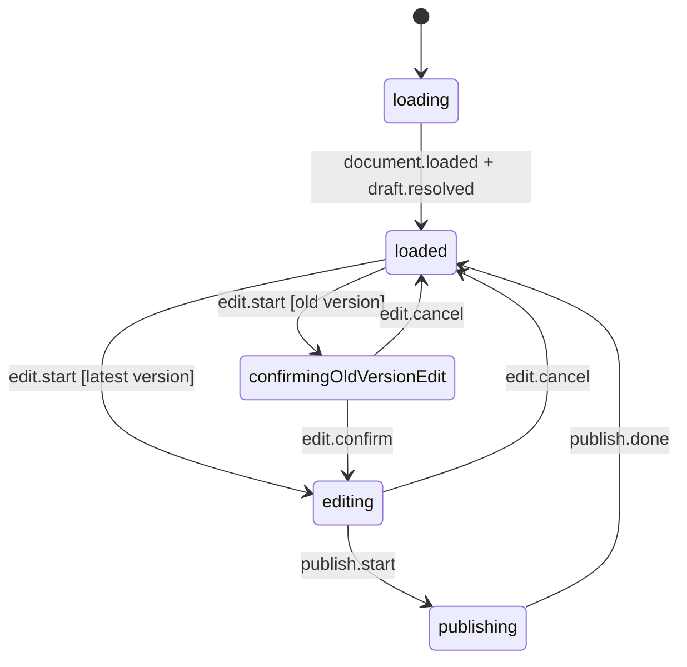
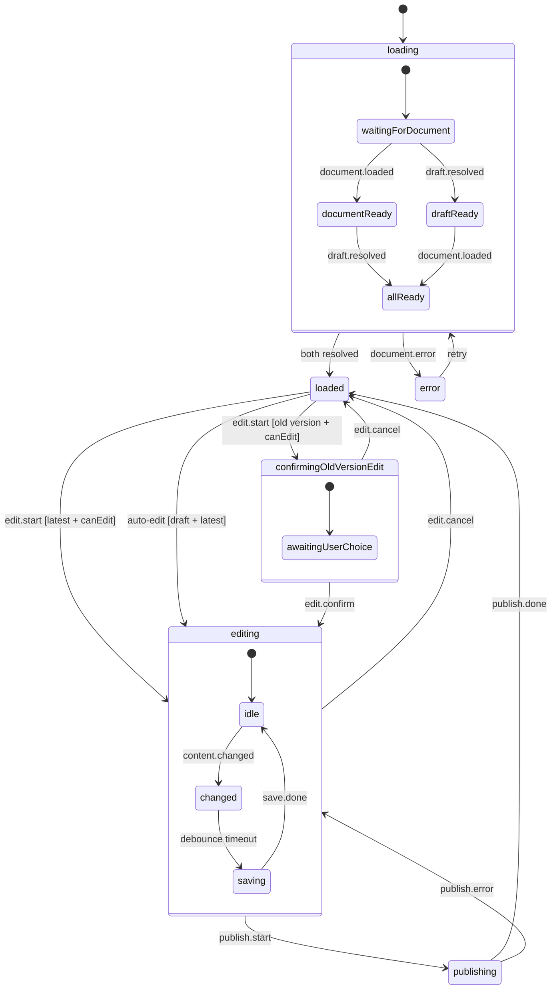

# Why State Machines Are a Game-Changer for UI Development

> A practical example: adding an "edit older version" confirmation guard to a document editor — with zero changes to existing UI triggers.

## The Problem

You're building a document editor. Users can navigate to older versions of a document. If they start editing an old version, it silently creates a branch in the document history — often unintentional. You need to warn them first.

Sounds simple, right? But your app has **multiple ways** to enter edit mode:

- Clicking the document title
- Clicking the editor area
- Auto-entering edit mode when a draft exists
- Keyboard shortcuts

With traditional `useState`-based approaches, you'd need to find **every single trigger** and add a guard. Miss one? Bug. Add a new entry point later? Probably another bug.

## The State Machine Approach

With a state machine, editing is a **state** — not a boolean. Every path into that state goes through the machine. Add a guard in one place, and it applies everywhere.

Here's the mental model:



The key insight: **we didn't touch any UI code that triggers `edit.start`**. The machine routes the transition based on context.

## Before: Boolean Spaghetti

Without a state machine, you'd end up with something like this scattered across your components:

```tsx
// ❌ Every edit trigger needs the guard
function onTitleClick() {
  if (!isLatest) {
    setShowConfirmDialog(true)
    return
  }
  setIsEditing(true)
}

function onEditorClick() {
  if (!isLatest) {
    setShowConfirmDialog(true) // duplicated!
    return
  }
  setIsEditing(true)
}

// And what about auto-edit when a draft exists?
useEffect(() => {
  if (hasDraft && !isLatest) {
    // Wait, do we show the dialog here too?
    // What if the user navigates to latest while the dialog is open?
  }
}, [hasDraft, isLatest])
```

Every new entry point means another place to remember the guard. Every edge case (draft exists + old version + account switch) multiplies the conditionals.

## After: One Machine, One Guard

With XState, the guard lives in the machine definition:

```ts
// ✅ One place, all entry points covered
'edit.start': [
  {
    target: 'confirmingOldVersionEdit',
    guard: 'canEditOldVersion',     // old version → confirm first
  },
  {
    target: 'editing',
    guard: 'canTransitionToEditing', // latest version → go ahead
  },
],
```

The auto-edit transition for existing drafts gets the same treatment:

```ts
// Auto-edit guard: only on latest version
always: {
  target: 'editing',
  guard: ({context}) => context.shouldAutoEdit && context.isLatestVersion,
  actions: ['clearShouldAutoEdit', 'setDepsFromPublished'],
},
```

The confirmation state handles only its own concern:

```ts
confirmingOldVersionEdit: {
  on: {
    'edit.confirm': {
      target: 'editing',
      actions: ['setDepsFromPublished'],
    },
    'edit.cancel': {
      target: 'loaded',
    },
  },
},
```

## The UI: Dead Simple

The dialog component is purely declarative — it reads state and sends events:

```tsx
function OldVersionEditDialog() {
  const isConfirming = useDocumentSelector(selectIsConfirmingOldVersionEdit)
  const send = useDocumentSend()

  return (
    <AlertDialog open={isConfirming}>
      <AlertDialogContent>
        <AlertDialogTitle>Edit older version?</AlertDialogTitle>
        <AlertDialogDescription>
          Editing this version will create a new branch in the document history.
        </AlertDialogDescription>
        <AlertDialogCancel onClick={() => send({type: 'edit.cancel'})}>
          Cancel
        </AlertDialogCancel>
        <AlertDialogAction onClick={() => send({type: 'edit.confirm'})}>
          Edit Anyway
        </AlertDialogAction>
      </AlertDialogContent>
    </AlertDialog>
  )
}
```

Drop this component anywhere in the tree. It works because it talks to the machine, not to local state.

## The Full Picture

Here's the complete document lifecycle with the new confirmation guard:



## Why This Matters

| Concern | Boolean approach | State machine |
|---------|-----------------|---------------|
| New edit entry point | Must add guard manually | Automatic — goes through machine |
| Edge case (draft + old version) | Another `if` somewhere | Guard on `always` transition |
| Testing | Mock click handlers, check booleans | Send events, assert states |
| Visualizing behavior | Read code, build mental model | Generate diagram from definition |
| Adding new states (e.g. "merging") | Refactor everything | Add a state node |

The real win isn't fewer lines of code — it's **fewer places where things can go wrong**. When behavior lives in the machine, you can reason about it in one place, test it in isolation, and visualize it as a diagram.

## Testing: Events In, States Out

State machine tests are clean because they're just input → output:

```ts
test('edit.start on old version → confirmation state', () => {
  const actor = createActor(documentMachine, {
    input: { isLatest: false, canEdit: true, /* ... */ }
  })
  actor.start()

  // Simulate document load
  actor.send({type: 'document.loaded', document: mockDoc})
  actor.send({type: 'draft.resolved', draftId: null, content: null})

  // Try to edit
  actor.send({type: 'edit.start'})

  // Machine routes to confirmation, not editing
  expect(actor.getSnapshot().matches('confirmingOldVersionEdit')).toBe(true)
})

test('edit.confirm → enters editing', () => {
  // ... setup in confirmingOldVersionEdit state ...
  actor.send({type: 'edit.confirm'})
  expect(actor.getSnapshot().matches('editing')).toBe(true)
})
```

No DOM, no mocking click handlers, no rendering components. Pure logic.

## Getting Started

If you're new to state machines in UI:

1. **Start small** — model one complex interaction (a multi-step form, a data loading flow)
2. **Use the visualizer** — [stately.ai/viz](https://stately.ai/viz) turns your machine definition into an interactive diagram
3. **Think in states, not booleans** — instead of `isLoading && !isError && hasData`, model `loading`, `error`, `loaded` as distinct states

The code from this post is from a real production app. You can see the full implementation in [PR #459](https://github.com/seed-hypermedia/seed/pull/459), specifically:

- Machine definition: [`document-machine.ts`](https://github.com/seed-hypermedia/seed/pull/459/commits/73c6efee7) (commit `73c6efee7`)
- React hooks & selectors: `use-document-machine.ts`
- UI dialog: `resource-page-common.tsx`

## Resources

- [XState v5 docs](https://stately.ai/docs/xstate-v5)
- [Stately visual editor](https://stately.ai/editor)
- [David Khourshid — "State Machines in UI"](https://www.youtube.com/watch?v=VU1NKX6Qkxc)
