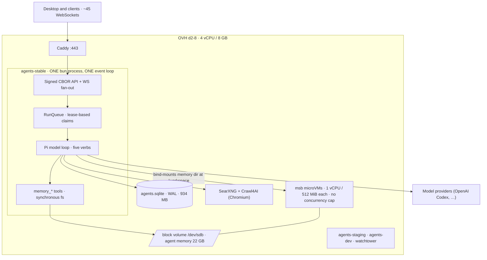
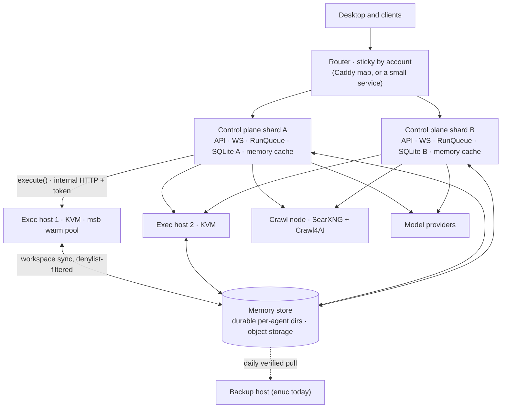
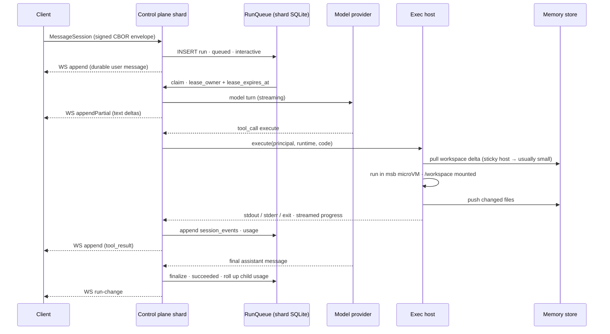
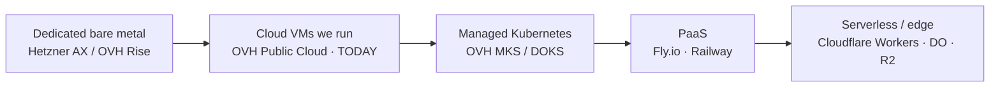

# Agent Fleet Architecture

_Published on Seed: https://hyper.media/hm/z6MkoKwFXr4NGUdbMLEPBvnJeKEx9qDMADgYhAWStTFXxfc3/agent-fleet-architecture_

_Written 2026-09-14 against the production host as it stood that day, and against the agents source at `agents/src`.
Companion document: [**Per-Account Quotas and Accounting**](./per-account-quotas-and-accounting.md) — quotas are a
prerequisite for every topology below, not a feature of any one of them._

The question this answers, as Eric put it: should agent memory and the sandboxes stop living on the same machine as the
agent server, should the database stand alone, how would the ideal fleet operate, and how much of it do we run ourselves
versus hand to a service — dedicated servers at one end, Cloudflare at the other.

The short version: **exec must leave the box first, memory has to travel with it, the database should not leave at all**
— it should multiply. And the components belong at different points on the spectrum, which is fine.

## 1. Where we are

One OVH `d2-8` (4 vCPU, 8 GB, 50 GB fixed local disk, plus the 100 GB block volume attached 2026-09-14) runs everything.

Three facts about this diagram matter more than the rest:

- **Everything runs on one JavaScript thread.** `agents/src/main.ts` serves HTTP and WebSockets, `agents/src/runs.ts`
  runs the queue, and `api-service.ts` (16,177 lines, one `Service` class) executes every run — all on the same event
  loop. The team's own `docs/worker-isolated-execution.md` documents this as the structural ceiling.
- **The sandbox and the memory directory are physically coupled.** `code-exec.ts` boots each microVM with
  `.volume('/workspace', mount.bind(spec.memoryRoot))` — the agent's memory directory is bind-mounted into the guest.
  Code the model writes reads and writes the same files the `memory_*` tools and the desktop Memory tab see. This is a
  feature, and it is the single fact that makes "move the sandboxes" harder than it sounds.
- **The database is a single-writer file opened synchronously.** `sqlite.ts` opens `bun:sqlite` in WAL mode with a 64 MB
  page cache and 512 MB mmap. Every read that misses cache is a `pread64` on the event loop.

### What breaks first, in order

| Order | Bottleneck                                 | Evidence                                                                                                                                                                                         |
| ----- | ------------------------------------------ | ------------------------------------------------------------------------------------------------------------------------------------------------------------------------------------------------ |
| 1     | **Model providers** — rate limits and cost | 74% of session time is model turns. All 6 failed runs on 2026-09-14 were provider errors (`server_is_overloaded`, model-not-supported).                                                          |
| 2     | **CPU from sandboxes**                     | Three 1-vCPU microVMs saturated the 4-vCPU host on 2026-09-14: one at 76% CPU, `/api/health` at 0.4–1.6 s (normal ~1 ms). The volume was idle (`%iowait 0`).                                     |
| 3     | **The single event loop**                  | `run-concurrency.md`: the loop is expected to saturate at 6–8 concurrent runs regardless of the cap. Both prior incidents (GetAgent refetch storm, ListAgentMemory walk) were this loop at 100%. |
| 4     | **All state on one host**                  | `agents.sqlite` single-writer; memory dirs on local fs; the sandbox bind mount. Nothing can move without solving all three.                                                                      |

Scale today, for reference: 33 accounts, 21 agents, 200–500 runs/day. "Viral" is 100–1000× that.

## 2. The three splits, one at a time

Eric's instinct — memory, sandboxes, and the DB should each leave the coordinator — is right for two of the three and
wrong, productively, for the third.

### 2a. Sandboxes: yes, and first

**What co-location costs:** the sandboxes are the CPU. On 2026-09-14 the `bun` process was at 47% while a single guest
VM was at 76%. Every sandbox vCPU is a vCPU taken from the latency budget of every other tenant's chat.
`multi-server-architecture.md` says it plainly: scheduling sandboxes on the control plane "because there is spare CPU"
spends the latency budget everyone else depends on.

**What splitting costs:** the code has a seam but not the transport. `code-exec.ts` defines
`SandboxSource { acquire(spec) → SandboxLease }` and the executor is built from an injectable `SandboxSourceFactory` —
the warm pool (`createWarmPoolSource`) already proves the seam takes a different implementation without the execute path
changing. But `config.ts` allows `backend: '' | 'microsandbox'` only. **The `SEED_AGENTS_EXEC_BACKEND=remote` described
in `multi-server-architecture.md` does not exist in code.** It is a design, not an implementation.

**What the code would need:**

1. A thin exec daemon on a KVM host exposing `execute(request) → result` (plus availability and streaming progress) over
   internal HTTP with a bearer token. The `CodeExecutor` contract and the watchdog logic in `code-exec.ts` move behind
   it unchanged.
2. **A way for the workspace to reach the exec host** — the bind mount cannot cross a network. This is section 2b.
3. Sticky assignment per agent so the warm pool stays warm (`ExecPrincipal` is already
   `{accountId, agentId, sessionId}`; the pool key exists).

**Premature?** No. This is the split that is overdue. It is also the cheapest: the control plane goes back to being
"small and steady" and exec capacity becomes "add a host."

### 2b. Memory: it has to move, but not to where you'd think

**What co-location costs:** two things. `agent-memory.ts` reads and writes with `fs.readFileSync` / `fs.writeFileSync` /
`fs.readdirSync` — synchronous, on the only thread. The walk is bounded now (`maxEntries`, after the incident that froze
the loop 6–8 s per call), but every `memory_read` of a large file is still a blocking read. And the memory dir is what
the sandbox mounts, so wherever the sandbox goes, the memory must be reachable there.

**What splitting costs — honestly:** there is **no storage abstraction to swap**. `agent-memory.ts` takes a `stateDir`
path and calls `node:fs`. Memory has three consumers that all assume a local path: the `memory_*` verbs (server fs), the
desktop Memory tab's signed `*AgentMemory*` actions (server fs), and the sandbox bind mount (guest fs). Replacing this
with object storage means introducing an interface in front of all three, and the sandbox one is the hard case because a
microVM needs a real filesystem, not an S3 client.

**The team's own answer, which I think is correct:** don't put memory behind a network filesystem.
`multi-server-architecture.md`: "sync directory snapshots on demand (rsync-style, content-addressed) rather than a
network filesystem — executions are bursty and localized, and the workspace is already the durable copy." The exec host
pulls the agent's workspace before a run and pushes changed files after. The control plane remains the durable owner.
Sticky agent→exec-host assignment makes the sync incremental almost every time.

**What this session adds to that:** the sync cost is far lower than the 22 GB headline suggests. Of agent memory today,
**16 GB is regenerable** — `checkouts/`, `.cache/`, `pylibs/`, `ms-playwright/`, `node_modules/` — and **6 GB is
irreplaceable**. A workspace sync that excludes the same denylist the backup already uses moves a fraction of the bytes.
Ion's `checkouts/` alone is 5.3 GB of git working trees; the unpushed commits inside them bundle to 272 KB.

Longer term, the durable copy itself should leave local disk for object storage (with the control plane holding a local
cache), so agents can move between shards and the block volume stops being a growth ceiling. That is a Phase 3 concern —
see section 6 — and it is the change that needs the storage interface. **Premature today.** The block volume has 72 GB
free and grows online.

### 2c. The database: no — multiply it instead

**What co-location costs:** less than it looks. `agents.sqlite` is 934 MB; it lives on the same box as its only writer,
which is the correct place for a SQLite file. The cost is not co-location; it is that there is exactly one of it, so
there can be exactly one server.

**What "standalone" would cost:** either a shared SQLite over a network (which `persistence.md` explicitly warns about —
`MAX(seq)+1` event sequencing is not safe for multiple writers) or a migration to Postgres.
`multi-server-architecture.md` rejects both: "per-account sharding makes it unnecessary until far beyond current
horizons."

**Why sharding works here:** the service has what that document calls a lucky property — all durable state is
per-account. Accounts own agents; agents own `state_dir`, sessions, runs, triggers. Nothing needs a cross-account join.
So the horizontal move is N control planes, each with **its own** SQLite and data dir, owning a disjoint set of
accounts. Moving an account is "copy its rows and state dir, flip the route." The queue, the WebSocket fan-out
(`main.ts` keeps clients in an in-process `Set`), and the leases all stay per-shard and need no change.

**Premature?** Yes, today — one control plane handles thousands of accounts once exec is off it. But it is the right
_eventual_ answer, and it is cheaper than Postgres in both engineering and operations.

### One correction to the session's framing

An earlier reading of the runs table during the 2026-09-14 investigation concluded it "already has the shape for N
workers." Half right. `RunQueue.#claimNext` in `runs.ts` claims atomically —
`UPDATE runs SET status='claimed', lease_owner=?, lease_expires_at=? WHERE id=(SELECT … LIMIT 1)` — with `lease_owner`
set to a per-process `crypto.randomUUID()`. That is a real lease, and `sweepAtBoot` requeues what a dead process held.
But the atomicity comes from SQLite, so N workers on _one_ queue means N processes on _one_ SQLite file, which is
exactly what the team avoids. The five distinct `lease_owner` values in production are five server restarts, not five
workers. **Horizontal scale here is sharding (many queues), not many workers on one queue.**

## 3. The target fleet

Roles:

- **Router** — stateless. Maps account id → shard. Today this is one line in a Caddyfile because there is one shard.
- **Control plane shard** — the existing `agents-stable` binary, unchanged in wire API: signed CBOR, WebSocket fan-out,
  the RunQueue with its leases, its own SQLite, trigger and schedule monitors. Light, steady CPU. Holds a local cache of
  memory for the `memory_*` verbs and the desktop Memory tab.
- **Exec host** — a KVM machine running a thin daemon in front of the existing `CodeExecutor`. Owns the microVM warm
  pool. Scales by adding hosts. **This is where CPU cost lives**, and it scales with concurrent sandbox vCPUs, not with
  accounts.
- **Memory store** — the durable copy of every agent's workspace. Object storage eventually; the block volume on the
  control plane until the sync path exists.
- **Crawl node** — SearXNG and Crawl4AI, moved off the box the day memory gets tight (Chromium wants 4 GB).
- **Model providers** — external, and the first thing that saturates. Redundant keys and fallback belong to the quotas
  document.

### One run, end to end

What the sequence makes visible: the control plane spends its time waiting on the provider and on the exec host. The
only CPU it burns per turn is prompt prep, CBOR encode/decode of events, SQLite writes, and WebSocket batching — which
`run-concurrency.md` measured at ~36% of one core for 2 runs + a workflow + ~50 subscribers. Everything heavy is on the
other side of a network hop.

## 4. Alternatives considered

|                                                                                         | What it buys                                                                                                                                       | What it costs                                                                                                                                                                                                                                                    | Pick it when                                                                                  |
| --------------------------------------------------------------------------------------- | -------------------------------------------------------------------------------------------------------------------------------------------------- | ---------------------------------------------------------------------------------------------------------------------------------------------------------------------------------------------------------------------------------------------------------------- | --------------------------------------------------------------------------------------------- |
| **(a) Single box, vertical** — `b2-30` (8 vCPU / 30 GB, $120/mo vs $25 today) plus caps | 2–4× headroom in an afternoon. No code.                                                                                                            | Buying RAM you don't need to get vCPUs. Still one event loop, one host of state. Instance migration to change flavor.                                                                                                                                            | You need weeks, not a plan. Do it _and_ start (b).                                            |
| **(b) Split exec only**                                                                 | Removes bottleneck #2 entirely. Control plane becomes small and steady. Exec scales by adding hosts. ~€50/mo total in the team's Hetzner estimate. | The remote backend and workspace sync must be written (~the `multi-server` Phase 2 scope). Sticky assignment. A second machine to operate.                                                                                                                       | Now. This is the overdue split.                                                               |
| **(c) Shard by account**                                                                | Removes bottleneck #3 and #4 without replacing SQLite. Each shard is today's binary. Linear in accounts.                                           | A router. Account-move tooling. Cross-shard admin views (listing all agents) need a small metadata layer.                                                                                                                                                        | When one control plane's loop saturates — thousands of accounts or heavy WS fan-out. Not yet. |
| **(d) Full managed stack** — Postgres, object storage, a container platform             | Familiar shape. Storage and DB become someone else's pager.                                                                                        | Rewrites `sqlite.ts` and every `stmt()` call site (statements are prepared per-connection and cached). Loses the single-writer simplicity the queue depends on. And **it does not solve the KVM problem** — see section 5. Highest engineering cost, lowest fit. | Only if (c) proves insufficient, which is far beyond current horizons.                        |

Not on the list on purpose: rewriting the server in another language. The measurements say the server process is not the
bottleneck.

## 5. The in-house ↔ managed spectrum

This is the part Eric asked about directly. The honest framing: the choice is per component, and one hard constraint
decides most of it.

**The constraint: `microsandbox` needs `/dev/kvm`.** The compose file exposes it explicitly ("without the device the
service runs fine but every execution fails 502"). `environments.md` lists KVM as a requirement for any self-hosted
remote. Anything that cannot give us a KVM device cannot run our sandboxes — and that rules out the right-hand end of
the spectrum for exec, no matter how attractive it is for everything else.

| Rung                               | Good at, for this workload                                                                                                                                      | Cannot do                                                                                                                                                                                                                        | Cost posture                                   | Operational stress                                                                                                 | Lock-in                                |
| ---------------------------------- | --------------------------------------------------------------------------------------------------------------------------------------------------------------- | -------------------------------------------------------------------------------------------------------------------------------------------------------------------------------------------------------------------------------- | ---------------------------------------------- | ------------------------------------------------------------------------------------------------------------------ | -------------------------------------- |
| **Dedicated bare metal**           | KVM guaranteed. Best price per vCPU for always-on sandboxes. Fast local NVMe.                                                                                   | Elastic scale — provisioning is hours to days. No live resize.                                                                                                                                                                   | Lowest per-vCPU. Fixed monthly.                | High: hardware failures are yours, no snapshots, no console magic.                                                 | Low.                                   |
| **Cloud VMs we run** (today)       | KVM on the right flavors (OVH d2 exposes it). Terraform-able. Block storage grows online.                                                                       | Nested virt is **not universal** — must be verified per provider and flavor (see note below).                                                                                                                                    | Mid. $25/mo today; block storage $9.64/100 GB. | Medium: OS, Docker, disks, backups are ours — this session was that stress.                                        | Low–mid (Terraform, OpenStack).        |
| **Managed Kubernetes**             | Scheduling exec hosts as a node pool; autoscaling; rolling deploys.                                                                                             | KVM inside pods needs privileged nodes with nested virt — same per-provider question, plus a `/dev/kvm` device plugin. Heavy for three roles.                                                                                    | Mid–high (control plane fee + nodes).          | Medium–high: a new competence for a three-role compose stack. `multi-server-architecture.md` explicitly defers it. | Mid.                                   |
| **PaaS — Fly.io / Railway**        | The control plane and crawl node fit well: stateless-ish, Docker image, persistent volume, global anycast.                                                      | **Fly Machines are Firecracker VMs, but they do not expose KVM to the guest** — as far as I know, nested virtualization is not offered, so `msb` cannot run inside one. Verify before relying on it either way. Railway: no KVM. | Mid; per-machine, scale-to-zero.               | Low: deploys, restarts, volumes handled.                                                                           | Mid–high.                              |
| **Serverless / edge — Cloudflare** | Router (Workers), memory store (R2, S3-compatible, no egress fees), per-account coordination state (Durable Objects). Genuinely excellent fits for those three. | **No KVM. Hard no for sandboxes.** Also no long-lived bun process with an in-memory WebSocket set — the control plane would be a rewrite onto Durable Objects, which is (d) in disguise.                                         | Low for storage and routing; usage-priced.     | Lowest.                                                                                                            | High for compute; low for R2 (S3 API). |

**A verification item that matters:** the team's cost model in `multi-server-architecture.md` prices exec hosts as
Hetzner CCX (dedicated-vCPU cloud). Hetzner Cloud VMs, to my knowledge, do **not** expose nested virtualization, which
would make them unable to run `msb` at all. OVH's `d2` does (production proves it). Before adopting that cost model,
confirm `/dev/kvm` on the intended flavor — or price Hetzner dedicated (AX line) instead, which is bare metal and has
it. This is the kind of thing a one-hour test on a €4 VM settles; it should not be assumed in either direction.

### Recommendation, per component

| Component                | Rung                                                     | Why                                                                                                                                                                                                                    |
| ------------------------ | -------------------------------------------------------- | ---------------------------------------------------------------------------------------------------------------------------------------------------------------------------------------------------------------------- |
| **Exec hosts**           | **Cloud VMs with verified KVM, or dedicated bare metal** | The constraint decides it. Dedicated wins on price per always-on vCPU once there are ≥2 hosts; cloud VMs win while count is 1–2 and demand is bursty. Never PaaS, never edge.                                          |
| **Control plane shards** | **Cloud VMs we run (today), PaaS later**                 | Today it must sit next to its SQLite and block volume. Once memory's durable copy is in object storage, the control plane is a Docker image + one volume — a PaaS fit, and that is when operational stress drops most. |
| **Memory durable store** | **Object storage (R2 or OVH S3)**                        | Content-addressed, no egress fees on R2, trivially backed up, lets agents move between shards. The block volume is the right interim; it is not the destination.                                                       |
| **Database**             | **Stays with its shard, on local/block disk**            | SQLite belongs beside its single writer. "Standalone DB" is the wrong shape here — multiply shards instead.                                                                                                            |
| **Router**               | **Edge (Cloudflare Worker) or Caddy on a small VM**      | Stateless, tiny, and the one piece where edge is a pure win: TLS, anycast, account→shard map. Caddy until there are two shards.                                                                                        |
| **Crawl node**           | **Cloud VM or PaaS**                                     | Chromium wants RAM, not KVM. Any rung with 4 GB works.                                                                                                                                                                 |
| **Backups**              | **Object storage, cross-provider**                       | enuc is one machine in one place. A second destination on a different provider closes the last gap.                                                                                                                    |

The pattern: **keep in-house exactly the layer with the hard constraint (KVM) and the layer whose simplicity we depend
on (SQLite beside its writer); hand out the layers that are commodities (object storage, TLS/routing, headless
Chromium).** That is where "saving a bit of money with increased stress" actually pays — the stress of running exec
hosts buys the only thing no service will sell us. The stress of running our own S3 buys nothing.

## 6. Migration sequence

Each step holds on its own. Reversibility noted; the point of no return is marked.

| Step                                                             | Scope                                                                                                                                                                                                                                                                                                                                                                                                                                                                                                                                                                                                                                                                                                                                          | Reversible?                                                                                                                                                                                   |
| ---------------------------------------------------------------- | ---------------------------------------------------------------------------------------------------------------------------------------------------------------------------------------------------------------------------------------------------------------------------------------------------------------------------------------------------------------------------------------------------------------------------------------------------------------------------------------------------------------------------------------------------------------------------------------------------------------------------------------------------------------------------------------------------------------------------------------------- | --------------------------------------------------------------------------------------------------------------------------------------------------------------------------------------------- |
| **0. Quotas + observability**                                    | Per-account caps on concurrent runs, sandboxes, memory bytes; event-loop lag, queue depth, sandbox count, sqlite write latency exported to `monitoring/`. A load-test number on staging.                                                                                                                                                                                                                                                                                                                                                                                                                                                                                                                                                       | n/a — prerequisite for everything below. See the [companion document](./per-account-quotas-and-accounting.md).                                                                                |
| **1. Contain the box** (this week)                               | Drop `--inspect` (on since 09-07, marked temporary). Add a real sandbox concurrency cap. `SEED_AGENTS_EXEC_MAX_VMS` (default 3) is the _retained warm-pool size_, not a concurrency limit — overflow VMs are unbounded, so nothing today stops N parallel `execute` calls booting N VMs (`code-exec.ts`: "the cap can never make a call fail or wait"; `docs/run-concurrency.md` says otherwise and is stale). The three VMs that saturated the box matching the pool size was coincidence. The fix is the global semaphore proposed as PR 1 in the quotas document (`SEED_AGENTS_EXEC_MAX_CONCURRENT`, default vCPUs − 2). Turn on `SEED_AGENTS_WORKFLOW_WORKER=1` — merged, tested, off in prod, free. Consider `b2-30` if weeks are needed. | Fully. Env vars and a flavor.                                                                                                                                                                 |
| **2. Split exec** (`multi-server` Phase 2)                       | Write the remote backend behind the existing `SandboxSource` seam; the exec daemon; denylist-filtered workspace sync; sticky assignment. Stand up one KVM exec host. `SEED_AGENTS_EXEC_BACKEND=remote`.                                                                                                                                                                                                                                                                                                                                                                                                                                                                                                                                        | Fully. Flip the env var back to `microsandbox` and the box runs sandboxes locally again.                                                                                                      |
| **3. Move the crawl node**                                       | SearXNG + Crawl4AI to their own small VM.                                                                                                                                                                                                                                                                                                                                                                                                                                                                                                                                                                                                                                                                                                      | Fully.                                                                                                                                                                                        |
| **4. Memory durable store → object storage**                     | Introduce the storage interface in `agent-memory.ts`; control plane keeps a local cache; exec hosts sync from the store.                                                                                                                                                                                                                                                                                                                                                                                                                                                                                                                                                                                                                       | Reversible until the block volume is decommissioned. **This is the point of no return for topology** — after it, agents are no longer pinned to a host, and going back means re-pinning them. |
| **5. Shard by account** (`multi-server` Phase 3)                 | Router; second control plane with its own SQLite; account-move tooling.                                                                                                                                                                                                                                                                                                                                                                                                                                                                                                                                                                                                                                                                        | Per account: copy back and flip the route. Practically one-way once dozens of accounts have moved.                                                                                            |
| **6. Worker-isolated agent runs** (`worker-isolated` Phases 3–5) | Runs execute in Worker threads over an effect bridge; the main thread keeps API, WS, queue, SQLite writes.                                                                                                                                                                                                                                                                                                                                                                                                                                                                                                                                                                                                                                     | Flag-guarded (`SEED_AGENTS_RUN_WORKER`). Independent of the topology steps; raises per-shard capacity from ~6–8 runs to "cores minus sandboxes."                                              |

Steps 2 and 6 are independent and both large; 2 is the one that changes the operational picture. Step 4 is the one to
think hardest about, because it is the one that is genuinely hard to undo.

## 7. What we don't know yet

- **The load-test number.** How many concurrent runs, sandboxes, and WebSocket clients push `/api/health` p99 past 100
  ms on the current build. Nobody has measured it; `run-concurrency.md` estimates 6–8 runs from a 36% reading at 2.
  Staging exists for this.
- **Provider rate limits and per-account cost.** The first wall in a viral scenario, and the one with no infra answer.
  Belongs to the quotas document.
- **KVM availability per provider/flavor.** The Hetzner Cloud question above, and Fly. One afternoon of tests.
- **Workspace sync cost in practice.** How large the post-run delta is for a heavy agent (Ion's checkouts churn), and
  whether sticky assignment keeps it small enough that exec latency stays under the ~200 ms boot it replaces.
- **Memory growth policy.** 16 of 22 GB is regenerable scratch. Without a per-agent quota and periodic cleanup, the
  volume is the next incident regardless of where it lives.
- **Whether the control plane's own memory reads need to leave the loop.** `agent-memory.ts` is still synchronous `fs`.
  Bounded walks fixed the listing; a 100 MB `memory_read` still blocks. An async read path is cheap and independent of
  every topology decision.
- **Restore time at 10× data.** Today's 7 GB backup restores in minutes. The number that matters is the one at 70 GB.
