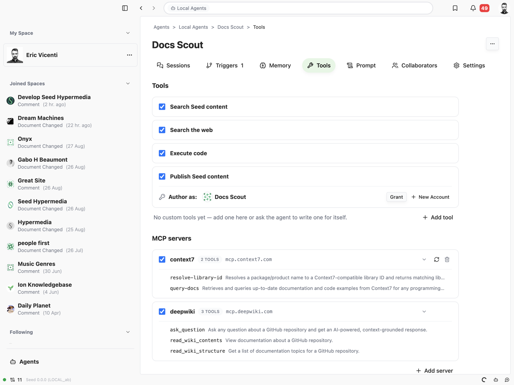
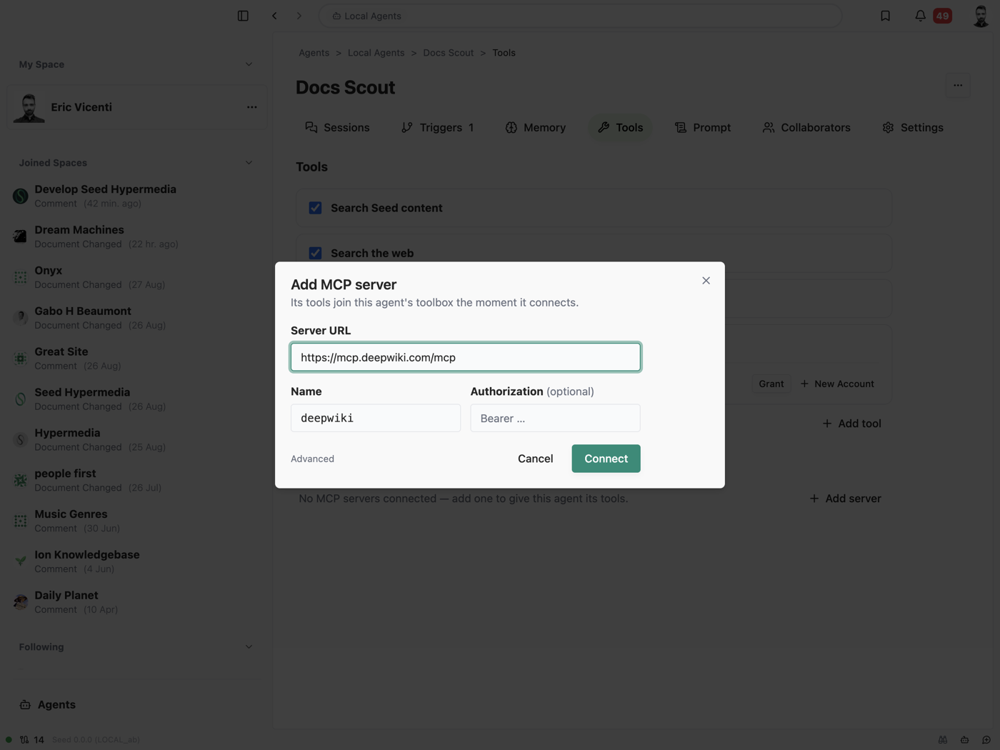
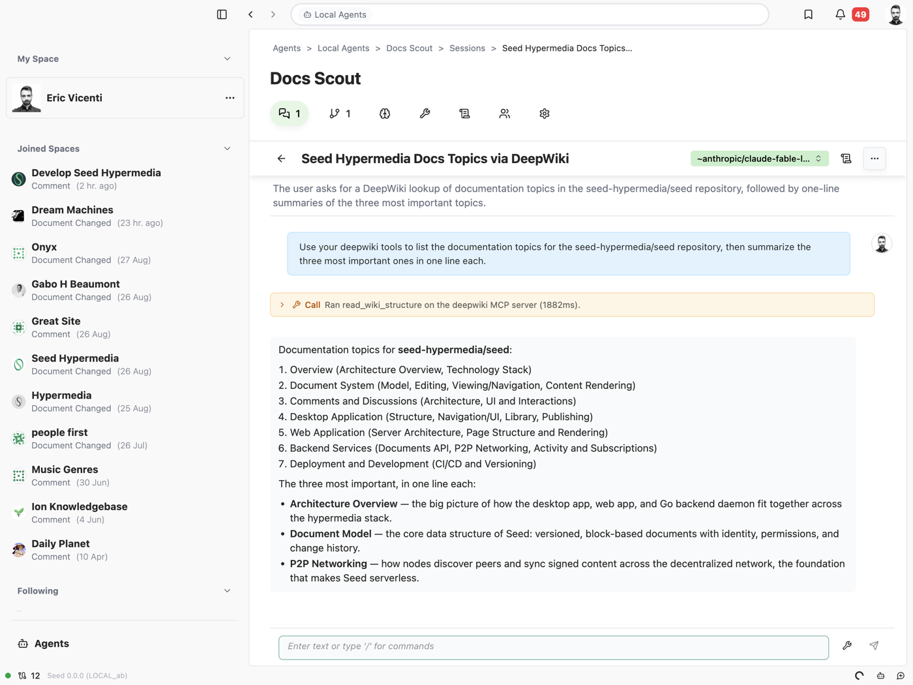
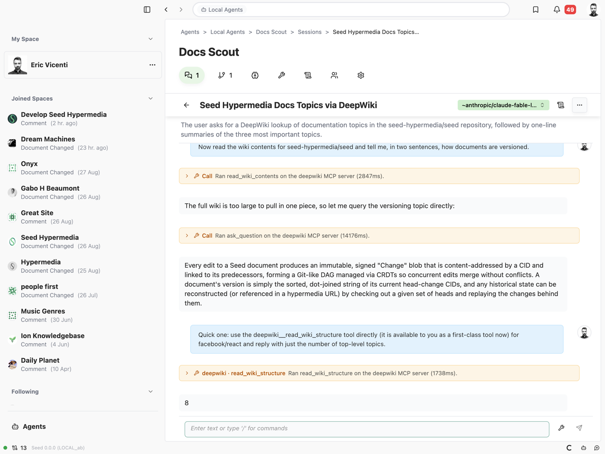

# MCP servers

Agents can call tools from remote [Model Context Protocol](https://modelcontextprotocol.io) (MCP) servers. An account
connects servers the way it configures model providers; each agent enables the servers it may use. Nothing about the
model-facing surface changes: the five verbs stay the whole surface, and every remote tool arrives as a **tool
document** in the agent's `~/tools/` — so it is listed in the Space index, read as a contract, dispatched through
`call`, and promoted like any builtin or lambda (see [`tools.md`](./tools.md)).

## Scope and transports

Only **remote HTTP MCP servers** are supported. The hosted, multi-tenant Agents service never spawns local `stdio`
subprocesses. Two transports are accepted:

- `http` — Streamable HTTP (the current MCP transport);
- `sse` — legacy HTTP+SSE.

With `transport` unset, the service tries Streamable HTTP first and falls back to SSE on a connect failure, per the MCP
backwards-compatibility guidance; the first error is the one reported.

Authentication is **static request headers**, typically `Authorization: Bearer …`, stored as encrypted account secrets.
There is no interactive OAuth flow: an MCP server that requires a browser login cannot be connected until a pre-obtained
token can be pasted in as a header.

Code: `agents/src/mcp.ts` (connect, discover, proxy, the per-run connection pool), `agents/src/tool-documents.ts`
(`syncMcpToolDocuments`, the projection), `agents/src/api-service.ts` (actions and runtime wiring). The client is
`@modelcontextprotocol/sdk`.

## The model

```
account ──< mcp_servers (name, config, discovered tools, status)
agent.definition.mcpServers = ['github', 'linear']         ← the grant
agent's tool_documents ⊇ {kind: 'mcp', name: 'github__create_issue', server: 'github', remoteName: 'create_issue', …}
```

- **Server record** (`mcp_servers`, see [`persistence.md`](./persistence.md)): `config_cbor` is
  `{url, transport?, headers?, secretRefs?}`; `tools_cbor` is the tool list from the last successful discovery;
  `status_cbor` is `{state: 'ok' | 'error' | 'unknown', error?, checkedAt?}`.
- **Grant**: `definition.mcpServers` names the servers an agent may call (at most 16). Server names are slugs
  (`^[a-z0-9][a-z0-9_-]{0,31}$`) because they prefix every projected tool name.
- **Projection**: every tool of every enabled server is an `mcp` tool document named `<server>__<tool>` (the remote name
  sanitized to `[A-Za-z0-9_-]`, the whole name capped at 64 characters — what providers accept as a tool name). The
  document carries the remote description and input schema, plus `server` and `remoteName`; its CID is its version, so a
  server changing a contract shows as a new CID. `syncMcpToolDocuments()` reconciles one agent's `mcp` documents with
  its grant — it runs eagerly on `CreateAgent`/`UpdateAgent`, on every discovery, and on `DeleteMcpServer`, and
  opportunistically on `ListAgentTools`, at run start, and before a user's palette verb. It is idempotent and DB-only. A
  name already held by an authored lambda is left to the lambda and logged as a conflict.

The remote input schema is kept whole (minus `$schema`/`$id`): the bounded local validator ignores keywords it does not
model, so `call` still validates what it can and touch-expand answers a miss with the real contract, while a promoted
tool hands the provider the full schema. Only a root that is not an object falls back to `{type: 'object'}`.

## Discovery

Connecting to a server to list its tools happens:

- on `SetMcpServer` — the response carries the result, so a client shows "connected, N tools" or the exact failure at
  once. A failed discovery **still saves** the record (the owner may be fixing a header; the server may be down);
- on `RefreshMcpServer`;
- quietly, whenever a run opens a connection to the server (see below) — so a server that added tools yesterday is
  current the next time any agent calls it.

A failed discovery records the error but keeps the last good tool list: an outage must not strip tools from agents that
will call them once the server is back. A changed tool list re-projects onto every agent that enables the server and
emits `agent-tools-changed`, so an open Tools tab updates live.

## Runtime

Connections are **lazy and per run**. Nothing opens at run start; the first `call` of a server's tool connects
(`McpConnectionPool`, concurrent calls share the handshake), and the run's teardown closes whatever it opened. The pool
exists in the three places a verb executes — the agent turn (`#runPiAgent`), a script child's `ctx.call`, and a user's
palette verb (`InvokeSessionTool`) — and is absent nowhere a call could happen.

`executeMcpTool` (`api-service.ts`) is the executor `call` dispatches to for an enabled `mcp` document:

1. validate the input against the document — a miss returns the contract, exactly like a builtin;
2. check the grant itself (`definition.mcpServers` includes the document's server) — the projection is a cache of the
   grant, not the grant;
3. proxy the call over the pool with a 120s timeout;
4. a server-reported error (`isError`) and any transport failure are **thrown**, so they land on the log as
   `tool_result.error` the model can react to;
5. the result is `{summary, text?, result?, images?, durationMs}` — `text` is the joined text content (bounded at 256
   KiB), `result` is the server's `structuredContent`. Image content rides to vision models as inline parts; the durable
   event keeps only the count.

**Promotion** covers remote tools: once `read ~/tools/github__create_issue` or a `call` of it has entered the
transcript, the next turn hands the provider that document's name, description, and schema as a first-class tool
(`toolMetadataFromDocument`). The promotion filter admits the enabled callable set plus the agent's own enabled
non-builtin documents, re-derived from the definition at run start — a hallucinated name that matches nothing stays
inert.

**Space index**: remote tools list as `- github__create_issue — Open an issue. (github MCP)`. A server contributing more
than six tools collapses to one line, `- github__* — 23 tools from the github MCP server (read ~/tools/ to list them)`,
so a large server does not blow the index budget; `read ~/tools/` always lists every tool.

**`read ~/self`** reports `grants.mcpServers`.

## Signed actions

Account-scoped, standard envelope ([`signed-api.md`](./signed-api.md)):

- `ListMcpServers` → `{servers: RedactedMcpServer[]}`
- `SetMcpServer {name, config}` → `{server}` — create or update by name, then discover.
- `RefreshMcpServer {name}` → `{server}` — discover again.
- `DeleteMcpServer {name}` → `{name}` — deletes the record, the header secrets it owns (`mcp-<name>-…`), removes the
  name from every agent's `mcpServers`, and drops their projected documents.

`RedactedMcpServer` is
`{id, name, url, transport, headerNames, secretHeaderNames, hasSecrets, tools, status, createdAt, updatedAt}`; `tools`
entries are `{name, toolName, description?, inputSchema?}` where `toolName` is the document name. Secret values never
appear in any response.

## Desktop and web UI

The Tools tab ends with an **MCP servers** section ([`desktop-ui.md`](./desktop-ui.md)): one row per account server with
a per-agent checkbox, the tool count (or an **Unreachable** chip with the error underneath), an **Auth** chip when a
secret header is set, the host, and hover-revealed refresh/remove buttons; clicking the row expands its tools, and a
tool opens its contract. **Add server** takes a URL (the name suggests itself from the host), an optional auth header,
and transport under Advanced; the dialog reports the connect result and enables the server for the current agent.

## Screenshots

The Tools tab with two connected servers, one expanded:



Adding a server — the name suggests itself from the URL, the record connects on save:



A session calling a remote tool through `call`, and a later turn using the promoted tool directly:





## Security notes

- A server is reached with account-configured URLs and headers; the same outbound-network posture as `read https://…`
  applies — no private-network allow/deny list yet ([`security.md`](./security.md)).
- Header values are encrypted at rest and redacted everywhere; the client refuses to send one to a non-HTTPS remote
  agent server.
- An enabled server's tools run with whatever the remote server can do. Enabling a server is a grant on par with
  `execute`; the owner should trust it.
- The projection is never the authority: `executeMcpTool` re-checks the grant, and promotion is filtered against the
  agent's own enabled documents.

## Tests

- `agents/src/mcp.test.ts` — naming, headers, result flattening, a real Streamable HTTP round trip (auth header
  included), discovery, and the pool (one handshake per server, shared by concurrent calls, closed together).
  `agents/src/mcp-test-server.ts` is the throwaway server the tests stand up.
- `agents/src/tool-documents.test.ts` — the projection: sync, CID bump on a contract change, removal when disabled,
  lambda-name conflicts, refusal to delete or replace a remote tool.
- `agents/src/verbs.test.ts` — `call` dispatch to a remote tool, touch-expand on a miss, thrown server/transport errors,
  the grant check, image content, index/listing tags and the per-server collapse.
- `agents/src/api-service.test.ts` — the actions end to end against a live test server: discovery on save, invalid
  names/URLs/headers, a saved-but-unreachable server, projection onto agents through `CreateAgent`/`UpdateAgent`, delete
  scrubbing agents and secrets; and a full session in which the user calls a remote tool from the palette, the agent
  calls it through `call`, and the tool is promoted on the following turn.
