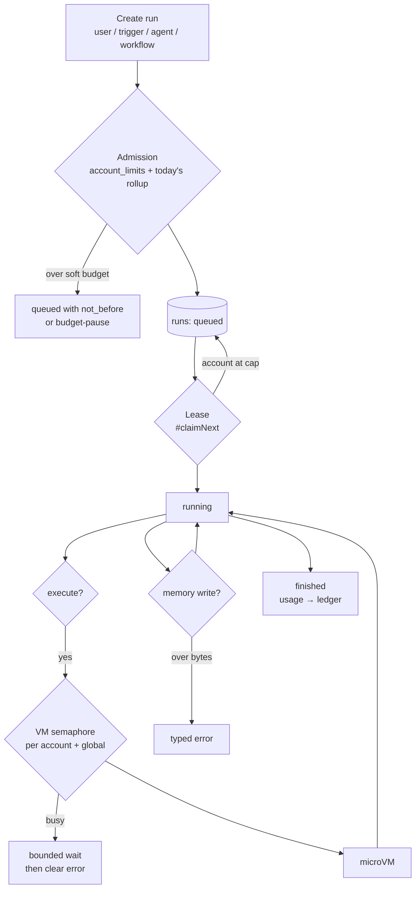
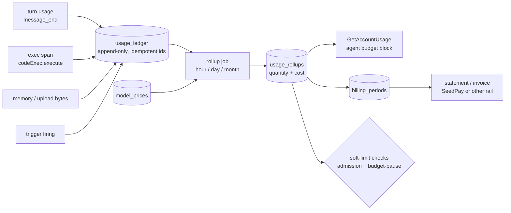

# Per-Account Quotas and Accounting

_What is metered and enforced today (from the code), what to meter, where to enforce, and how the usage ledger becomes a
bill — a prerequisite for every topology in the Agent Fleet Architecture document._

_Published on Seed:
https://hyper.media/hm/z6MkoKwFXr4NGUdbMLEPBvnJeKEx9qDMADgYhAWStTFXxfc3/per-account-quotas-and-accounting_

Companion to [**Agent Fleet Architecture**](./agent-fleet-architecture.md). That document describes how to split the
coordinator, the sandboxes, the database, and agent memory across machines. None of those topologies helps if one tenant
can consume the whole of any of them. Per-account quotas are a prerequisite for all of them, and per-account accounting
is a prerequisite for quotas — so this document comes first, and it applies at today's scale of one box.

Everything below is grounded in `agents/src` as of 2026-09-14. **Exists** and **proposed** are kept rigorously apart,
because that distinction is the whole value of the document.

## 1. Why this matters regardless of scale

On 2026-09-14 two agents on the production host — the Epistemic Agent at 21 runs per hour and Ion at 17 — fanned out
enough work to have three microsandbox VMs executing at once. On a 4-vCPU box that also runs the API, WebSocket fan-out,
Caddy, SearXNG and Crawl4AI, `/api/health` went from about 1 ms to 0.4–1.6 s. Every account on the server felt it.
Nothing about either agent was wrong: they were doing exactly the work they were built for, inside a global cap of 8
concurrent model runs that they were nowhere near. The problem was that no limit anywhere was _per account_. The server
has no concept of "this tenant has had its share"; it has only "the box is full", and by then everyone is already
paying.

The second reason is quieter. Today the question "how much did account X use this month" has no answer short of decoding
`usage_cbor` on every one of its `runs` rows and adding them up by hand. There is no cost figure at all — the model
registry's `cost` fields are set to zero for every API-key provider and nothing multiplies tokens by a price. There is
no period, no ledger, no per-tenant view of sandbox seconds, memory bytes, trigger firings, or WebSocket load. You
cannot bill what you do not meter, you cannot forecast capacity from a number you do not have, and when the server is
slow you cannot say _who_ is making it slow without `ps` and a database query. Metering is the cheaper half of this work
and it pays off the day it ships, independent of whether any limit is ever enforced.

## 2. What exists today

The honest inventory. "Metered" means a number is durably recorded; "enforced" means a request can be refused or delayed
because of it.

| Dimension                         | Metered                                                            | Enforced                          | Scope              | Where                                                                                                                                                                                                                                                                                         |
| --------------------------------- | ------------------------------------------------------------------ | --------------------------------- | ------------------ | --------------------------------------------------------------------------------------------------------------------------------------------------------------------------------------------------------------------------------------------------------------------------------------------- |
| Model tokens per run              | **yes** — `RunUsage {input, output, cacheRead, cacheWrite, total}` | no                                | per run, rolled up | captured at `message_end` in `#runPiAgent` (`api-service.ts` ≈7505–7554), persisted by `RunQueue.updateUsage` (`runs.ts:657`) into `runs.usage_cbor`; children rolled into `usage.children` by `#rollupChildUsage` (`runs.ts:939`); also stamped per turn on `session_events` as `meta.usage` |
| Model cost                        | no                                                                 | no                                | —                  | `piModelForDefinition` (`api-service.ts` ≈11130) sets `cost` to zeros for API-key providers; Pi's catalog is consulted only for subscription models; nothing reads `cost` anywhere                                                                                                            |
| Concurrent model runs             | in-memory only                                                     | **yes, global**                   | whole server       | `SEED_AGENTS_MAX_CONCURRENT_MODEL_RUNS` (default 8, prod 8), `#pump` (`runs.ts:742`); workflows separately at 32                                                                                                                                                                              |
| Dispatch fairness                 | —                                                                  | **yes, ordering only**            | per account        | `#claimNext` (`runs.ts` ≈763–800): fewest held slots first, then interactive before background, then oldest. Added 2026-09-07. No per-account _cap_ on slots                                                                                                                                  |
| Delegation shape / wall clock     | yes                                                                | **yes, per tree**                 | per run tree       | `RunBudget {maxDepth, maxChildren, maxWallMs?}` copied to children; `budget-pause` wait reason and `resumeBudgetPause` (`runs.ts:520`); presets in `docs/delegation-budgets.md`                                                                                                               |
| Concurrent sandbox VMs            | counters only (`exec.pool_*`)                                      | **no**                            | —                  | `SEED_AGENTS_EXEC_MAX_VMS` (default 3) is `poolMaxVms`, the _retained warm-pool size_. Overflow VMs are unbounded: "the cap can never make a call fail" (`code-exec.ts:528`). Per VM: 1 vCPU, 512 MiB, 60 s + host watchdog                                                                   |
| Active uploads                    | in-memory                                                          | **yes, per account**              | per account        | `MAX_ACTIVE_UPLOADS_PER_ACCOUNT = 8` (`api-service.ts:248`, enforced `:3839`, HTTP 429). Per file: 2 GiB memory, 100 MiB attachment. Lives in a `Map`, not the database                                                                                                                       |
| Agent memory bytes                | no                                                                 | no                                | —                  | only path length 512 B, depth 16, and listing caps (`agent-memory.ts`)                                                                                                                                                                                                                        |
| WebSocket clients / subscriptions | count in logs                                                      | no                                | —                  | `clients` set in `main.ts:328`; roadmap "WebSocket protocol v2 … subscription limits, backpressure"                                                                                                                                                                                           |
| HTTP request rate                 | no                                                                 | no                                | —                  | roadmap, security hardening item 3: "Rate limits and quotas"                                                                                                                                                                                                                                  |
| Trigger firings                   | rows in `trigger_firings`                                          | per-trigger `cooldown_ms` + dedup | per trigger        | `agent_triggers.cooldown_ms`; `UNIQUE (account_id, trigger_id, activity_key)`. No per-account rate                                                                                                                                                                                            |
| Activity polling                  | —                                                                  | 60 s cycle / 20 s request         | **shared**         | `activity-monitor.ts:24–25`; one heavy account has starved other accounts' mention triggers (`docs/perf-squeeze-plan.md`)                                                                                                                                                                     |
| Latency / error observability     | yes                                                                | —                                 | **process-wide**   | `GET /api/perf` rolling percentiles and counters (`perf.ts`), unauthenticated, no account dimension; `GET /api/perf/sessions/:id` per-session rollup (`session-perf.ts`)                                                                                                                      |

Two corrections to things said earlier in this investigation, both from the code:

- `SEED_AGENTS_EXEC_MAX_VMS` **is** implemented, but it is not a concurrency limit. `docs/run-concurrency.md` says
  "sandbox CPU is bounded separately by `SEED_AGENTS_EXEC_MAX_VMS` (default 3)"; the code says the opposite. Today the
  only thing bounding sandbox concurrency is the model-run cap times however many `execute` calls a run issues at once —
  and a workflow's `ctx.parallel` can issue several.
- Cross-account fair-share dispatch is not a proposal; it shipped on 2026-09-07. What is missing is a cap, weights, and
  the same idea applied to sandboxes and polling.

The attribution chain, on the other hand, is complete in the schema and needs nothing new:
`runs.account_id / agent_id / session_id / trigger_firing_id / root_run_id / parent_run_id`,
`sessions.account_id / agent_id`, `trigger_firings.account_id / agent_id / trigger_id`, `session_events.session_id`.
Every tool call is a `session_events` row with `meta.durationMs`, and sandbox results carry `bootMs`. The `accounts`
table itself is only `{id, created_at, updated_at}` — there is no tier, plan, or limits column, which is the first thing
section 4 adds.

## 3. What to meter — the accounting model

Attribution flows one way and every metric hangs off it:

```
account → agent → session → run (tree by root_run_id) → tool call (session_events.seq)
```

| Dimension | Metric                                                        | Unit         | Emission point                                                       | Status                                          |
| --------- | ------------------------------------------------------------- | ------------ | -------------------------------------------------------------------- | ----------------------------------------------- |
| Model     | input, output, cacheRead, cacheWrite tokens per turn          | tokens       | `message_end` handler in `#runPiAgent`                               | **exists** (run-scoped); ledger row proposed    |
| Model     | cost                                                          | micro-USD    | computed at rollup from a price table, never at emission             | proposed                                        |
| Model     | ttft, turn latency, error by reason                           | ms / count   | `recordPerf('provider.*')` (`api-service.ts:7489–7518`)              | **exists** (process-wide); account tag proposed |
| Sandbox   | VM-seconds, vCPU-seconds, MiB-seconds, boots, concurrent peak | s / count    | around `context.codeExec.execute` (`api-service.ts:12737`, `:13007`) | proposed (`exec.total` exists as latency)       |
| Runs      | started, concurrent peak, by `queue` and `origin`             | count        | `RunQueue` create (`runs.ts` ≈450) and `#claimNext`                  | proposed (rows exist; no aggregation)           |
| Storage   | agent memory bytes, split irreplaceable vs scratch            | bytes        | memory write / upload finalize; nightly `du` reconciliation          | proposed                                        |
| Storage   | `session_events` rows and bytes per account                   | rows / bytes | append path                                                          | proposed                                        |
| Network   | HTTP requests by action, WS connections, WS frames fanned out | count        | `createAPIRoutes` dispatch; `publish` in `main.ts:329`               | proposed                                        |
| Triggers  | firings per trigger per hour, runs they spawned               | count        | `trigger_firings` insert                                             | **exists** as rows; aggregation proposed        |

**Ledger, proposed.** One append-only table, one periodized rollup, one limits table. All three are per account, so they
shard with everything else in the fleet document.

```sql
CREATE TABLE usage_ledger (
  id            TEXT PRIMARY KEY,        -- idempotency key, see §7
  account_id    TEXT NOT NULL REFERENCES accounts (id),
  agent_id      TEXT, session_id TEXT, run_id TEXT, root_run_id TEXT,
  dimension     TEXT NOT NULL,           -- 'model.tokens' | 'exec.vm_seconds' | 'memory.bytes_delta' | ...
  quantity      INTEGER NOT NULL,        -- integer units only; tokens, ms, bytes
  attrs_cbor    BLOB,                    -- {provider, model, queue, origin, runtime, toolName}
  occurred_at   INTEGER NOT NULL
) WITHOUT ROWID;
CREATE INDEX usage_ledger_by_account_time ON usage_ledger (account_id, occurred_at);

CREATE TABLE usage_rollups (
  account_id TEXT NOT NULL, period TEXT NOT NULL,   -- '2026-09-14T13' | '2026-09-14' | '2026-09'
  dimension  TEXT NOT NULL, attrs_key TEXT NOT NULL, -- canonical string of the attrs that matter for price
  quantity   INTEGER NOT NULL, cost_micro_usd INTEGER,
  PRIMARY KEY (account_id, period, dimension, attrs_key)
) WITHOUT ROWID;

CREATE TABLE account_limits (
  account_id TEXT PRIMARY KEY REFERENCES accounts (id),
  limits_cbor BLOB NOT NULL,            -- {concurrentRuns, concurrentVms, tokensPerDay, ...}; absent key = server default
  weight      INTEGER NOT NULL DEFAULT 1,
  updated_at  INTEGER NOT NULL
) WITHOUT ROWID;
```

Live counters (concurrent runs, concurrent VMs, open sockets) are not ledger rows; they are in-memory maps owned by the
process that enforces them, exactly as `#inflightKinds` and the uploads `Map` are today. The ledger records what
_happened_; the maps decide what may happen _now_.

## 4. Quotas — the enforcement model

Two classes. **Hard** limits protect the host and every other tenant; they are about _concurrency_ and are enforced
instantly and in memory. **Soft** limits are _budgets_ over a period; they are enforced from the ledger and their breach
is a conversation, not a wall — the `budget-pause` mechanism the delegation work already built is the right shape for
it.

| Dimension                 | Class     | Default (today's scale, estimate) | Enforced at                                                               | On breach                                                                                                               |
| ------------------------- | --------- | --------------------------------- | ------------------------------------------------------------------------- | ----------------------------------------------------------------------------------------------------------------------- |
| Concurrent sandbox VMs    | hard      | 2 per account; global = vCPUs − 2 | new semaphore in front of `codeExec.execute`, keyed by account            | tool call waits up to N s, then returns a clear "sandbox busy, try fewer parallel calls" to the model                   |
| Concurrent model runs     | hard      | ⌈global ÷ 2⌉ = 4 per account      | `#claimNext` WHERE clause                                                 | run stays `queued`; UI shows "waiting: account at 4/4 runs"                                                             |
| Background share of those | hard      | 2 of the 4                        | same clause, by `queue`                                                   | background yields to interactive                                                                                        |
| WebSocket connections     | hard      | 16 per account                    | `websocket.open` / subscribe in `main.ts`                                 | oldest idle socket closed with a reason code                                                                            |
| Active uploads            | hard      | 8 (exists)                        | `#beginFileUpload`                                                        | 429 (exists)                                                                                                            |
| Trigger firings           | hard      | 60 per account per hour           | before `createRun` in `activity-triggers.ts` / `schedule-triggers.ts`     | firing recorded with `status: 'throttled'`, no run; retried next poll                                                   |
| Agent memory              | soft→hard | warn 8 GB, refuse writes at 10 GB | memory write path and upload finalize; nightly reconciliation             | write returns a typed error the model can read; scratch dirs listed for cleanup                                         |
| Model tokens              | soft      | 5 M per account per day           | admission (`createRun`) reads today's rollup; mid-tree via `budget-pause` | 80 %: warning in every tool result; 100 %: interactive trees pause for a person, trigger trees finish alone and note it |
| Sandbox VM-seconds        | soft      | 4 h per account per day           | same                                                                      | same                                                                                                                    |
| Runs started              | soft      | 200 per account per hour          | admission                                                                 | background deferred via `not_before`; interactive admitted                                                              |

The defaults are deliberately loose against today's traffic (~200–500 runs/day _total_ across 33 accounts) so that
shadow mode in section 8 produces zero false positives before anything is enforced.

Where the gates sit on the run's path:



Two rules from `docs/run-concurrency.md` that belong here because quotas make them urgent: a child of an interactive
root should inherit `interactive` (today every delegated child is `background`, so a person's fan-out sits behind
everyone's heartbeats), and the queue class should be the thing that yields — when an account is at its cap, its
background runs should be what waits.

## 5. Fairness under contention

What already works: `#claimNext` orders candidates by how many slots the account currently holds, so two active tenants
interleave instead of one draining the queue. What it does not do:

1. **No cap.** An account alone on the box takes all 8 slots; a second account arriving gets exactly one slot as each of
   the first account's runs finishes. Fair-share _ordering_ converges slowly; a cap converges immediately.
2. **Not weighted.** Every account counts equally, which is right until there are tiers.
3. **Sandboxes have no scheduler at all.** First to call `execute` boots a VM; there is nothing to order.
4. **Polling is shared.** One 60-second cycle walks every account's activity; a slow one delays the rest.
5. **The ordering is a correlated `COUNT(*)` per candidate row** inside the `UPDATE … WHERE id = (SELECT …)`. Fine at
   hundreds of queued rows, not at tens of thousands.

Proposal, fitting the lease-based scheduler as it is:

- **Held-slots map.** The pump already maintains `#inflightKinds`; extend it to `Map<accountId, {agent, workflow, vms}>`
  and pass the accounts at cap into `#claimNext` as a `NOT IN (…)` list. Removes the correlated subquery and adds the
  cap in one change.
- **Weight.** `ORDER BY held ÷ weight` using `account_limits.weight`, defaulting to 1. Tiers later are one row update.
- **Queue inheritance.** At creation, look up `root_run_id`'s queue; children of an interactive root are interactive.
- **Sandbox fairness in the same shape.** Implement the per-account VM semaphore as a `SandboxSource` wrapper in
  `code-exec.ts` — the seam `docs/multi-server-architecture.md` already relies on — so the pick order is "fewest VMs
  held first" and agents code does not change. This also becomes the dispatch point when execution moves to separate
  hosts.
- **Per-account poll slices.** Give each account its own deadline inside the cycle so one slow feed cannot exhaust the
  60 s for everyone.

## 6. What the account sees

Enforcement without visibility produces the one thing worse than slowness: unexplained slowness. Three surfaces, all
proposed:

- **`GetAccountUsage`** (signed API):
  `{period, dimensions: {name: {used, limit, resetsAt}}, throttled: [{dimension, reason, since, until?}]}`. Backed by
  `usage_rollups` for budgets and the live maps for concurrency. **`ListUsageHistory`** pages the rollups.
- **On the run.** `run-concurrency.md` already added "Waiting to run" with a timer. Add
  `queuedReason: 'account-limit:concurrent_runs'` (or `…:tokens_per_day`) to the run surface so the status bar can say
  _why_, and emit an `account-usage` event on the existing `account/<id>` WebSocket subscription whenever a limit state
  flips.
- **To the agent.** `docs/delegation-budgets.md` milestone 2 proposes a `budget` block on every child result and on
  `~/self`; extend that same block with account-level remaining:
  `{tree: {...}, account: {tokensRemainingToday, vmSecondsRemainingToday, concurrentRuns: {held, limit}}}`. Ion's
  `heartbeat_admission` is an agent-authored lambda in `tool_documents`, not server code; it exists precisely because
  the server offers no admission signal. This block is the server-level replacement, and an agent that can see it can
  plan around it instead of discovering the wall by hitting it.

## 7. Accounting → billing readiness

Design the ledger so the invoice is a query, not a project:

- **Idempotent emission.** Every ledger row's `id` is derived from its source: `${run_id}:turn:${index}` for tokens,
  `${session_id}:${seq}` for a tool call, `${upload_id}` for storage. A retried turn or a replayed crash recovery writes
  the same id and is ignored, the way `action_idempotency` already protects actions.
- **Append-only, never edited.** Corrections are new rows with negative quantity and a `corrects` attribute.
- **Cost at rollup, not at emission.** Tokens are facts; prices change. A
  `model_prices (provider, model, effective_from, input_micro_usd_per_m, output…, cache_read…, cache_write…)` table,
  seeded from Pi's catalog where it has a figure and hand-maintained otherwise, is joined at rollup time. Re-pricing a
  month is re-running the rollup.
- **Provider ownership matters.** `model_providers.account_id` means accounts bring their own keys today; subscription
  (ChatGPT OAuth) runs spend the user's own subscription. Meter both identically; cost only the ones billed through a
  house key. `attrs.providerOwnership: 'account' | 'house'` on the row makes this one filter.
- **Periodization.** A rollup job closes each hour, day and month into `usage_rollups`; a
  `billing_periods (account_id, period, status: open|closed|invoiced, statement_cbor)` table is the seam where an
  invoicing system attaches.
- **SeedPay.** Nothing under `agents/` references SeedPay, payments, or invoices; there is no hook to preserve. The
  monthly rollup per account is the intended integration point, and nothing above assumes a particular payment rail.



## 8. Rollout plan

Meter before warning, warn before refusing. Each step is a PR that ships on its own.

1. **Real sandbox concurrency cap** (small, `config.ts` + `code-exec.ts`). Add `SEED_AGENTS_EXEC_MAX_CONCURRENT` as a
   global semaphore around `acquire`, distinct from `poolMaxVms`; default `vCPUs − 2`. Fixes today's failure mode on its
   own. Fix the stale sentence in `run-concurrency.md`.
2. **Queue inheritance** (small, `runs.ts` create path). Children of interactive roots are interactive.
3. **`account_limits` table + defaults + admin action** (small, `sqlite-schema.sql`, `api-service.ts`). No enforcement
   yet.
4. **`usage_ledger` + emission at the four existing points** (medium). Tokens at `message_end`, VM-seconds around
   `codeExec.execute`, bytes at memory write/upload finalize, firings at `trigger_firings` insert. Shadow mode: breaches
   are logged with the account id, nothing is refused. `GetAccountUsage` read-only.
5. **Rollup job + `usage_rollups`** (medium). Hourly; daily and monthly derived. `/api/perf`-style snapshot gains a
   per-account view behind the signed API (the public endpoint stays account-free).
6. **Soft limits** (medium). 80 % warnings in the `budget` block and the account event; 100 % via `budget-pause` for
   interactive trees, finish-and-note for triggers.
7. **Hard limits** (medium). Per-account run cap in `#claimNext` via the held-slots map, per-account VM semaphore,
   WebSocket cap, trigger rate, memory bytes.
8. **Prices, periods, statements** (medium). `model_prices`, `billing_periods`, monthly statement generation.

Steps 1–3 are days of work and remove the acute risk. Steps 4–5 are the real investment and are what the fleet
document's sharding depends on, because a ledger that is per-account from day one is one that can live on any shard.

## 9. Open questions

- **Who sets limits?** `accounts` has no tier. Manual `account_limits` rows first; a tier model can map onto
  `limits_cbor` later without a migration.
- **Public and collaborative agents.** `agents.public_chat` lets strangers chat with an agent; `agent_collaborators`
  lets others drive it. Usage is attributed to the _owning_ account today because that is where `runs.account_id`
  points. Is that the bill the owner expects?
- **Subscription runs.** Meter but do not cost, or cost at list price as a shadow figure so the owner can see what a
  house key would have charged?
- **Retention.** Ledger rows are small but numerous (`session_events` is already 124 k rows at 33 accounts). Keep raw
  rows for 90 days and rollups forever?
- **Fleet.** On multiple shards the ledger appends locally and rollups are gathered centrally; the limits table is the
  one thing that must be readable on every shard. Confirm this in the fleet document's data-placement section.
- **Should a soft-limit pause time out?** The same question `delegation-budgets.md` leaves open — an abandoned pause
  should not hold a tool call open forever.
