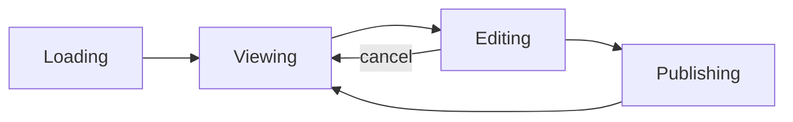
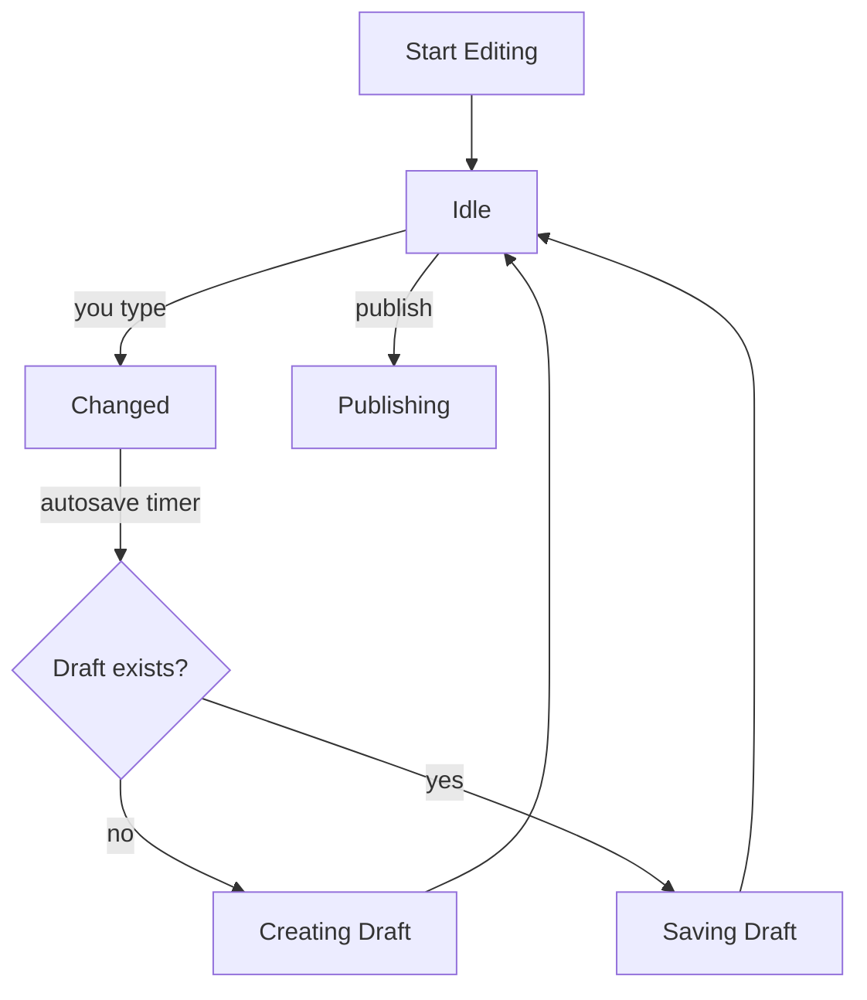

# How Document Editing Works

When you open a document in Seed, there's a system working behind the scenes to manage the entire lifecycle — from loading, to editing, to saving drafts, to publishing. This post explains what that system does, from your perspective as a user.

## The Big Picture

Every document goes through a predictable flow:

That's it. Four main stages. Let's walk through each one.

---

## 1. Loading

When you navigate to a document, the app fetches it from the network. You'll see a loading state for a brief moment. If the network is slow or something goes wrong, you'll see an error with the option to retry.

## 2. Viewing

Once loaded, you're in **viewing mode** — the document is displayed read-only. You can read, scroll, and interact with links, but you can't change anything yet.

If you have **edit access** and there's a **draft you left behind** from a previous session, the app will automatically take you into editing mode so you can pick up where you left off.

## 3. Editing

When you start editing, a few things happen automatically:

**Autosave** — Every time you pause typing, your changes are saved as a **draft** within about half a second. You never have to manually save. The first time you make a change, the system creates a new draft. After that, every subsequent change updates the same draft.

**Keep editing while saving** — If you keep typing while a save is in progress, the system remembers that and triggers another save as soon as the current one finishes. You never lose keystrokes.

**Cancel** — If you decide to discard your changes, you can cancel and go back to viewing the published version.

## 4. Publishing

When you're happy with your changes and hit **Publish**, the system takes your draft and turns it into the new published version of the document. Once publishing succeeds, the draft is cleaned up and you're back to viewing the freshly published document.

If something goes wrong during publishing, you're returned to editing mode with your draft intact — nothing is lost.

---

## Special Behaviors

- **Draft auto-resume**: If you close the app or navigate away while editing, your draft is already saved. Next time you open that document (with edit access), it picks up right where you left off — automatically in editing mode.

- **Account switching**: If you switch to an account that doesn't have edit access while you're editing, the system saves your draft and exits editing mode. Switch back to an editor account, and you can resume editing.

- **Remote updates**: If someone else publishes a new version of the document while you're editing, the system keeps track of it. Your editing session isn't interrupted — the update is noted and handled when appropriate.

---

## Why We Built It This Way

Previously, editing and viewing were two separate experiences with different code paths. The new system unifies them into a single, predictable flow. This means:

- **Fewer bugs** — One system manages the entire lifecycle instead of multiple disconnected pieces.
- **Better UX** — Autosave, draft resume, and account switching all "just work" because they're built into the core flow.
- **Easier to extend** — New features (like click-to-edit or collaborative editing) can plug into well-defined states instead of being bolted on.

The key idea: **the document is always in exactly one state**, and transitions between states are explicit and predictable. There's no ambiguity about what the app is doing at any given moment.
