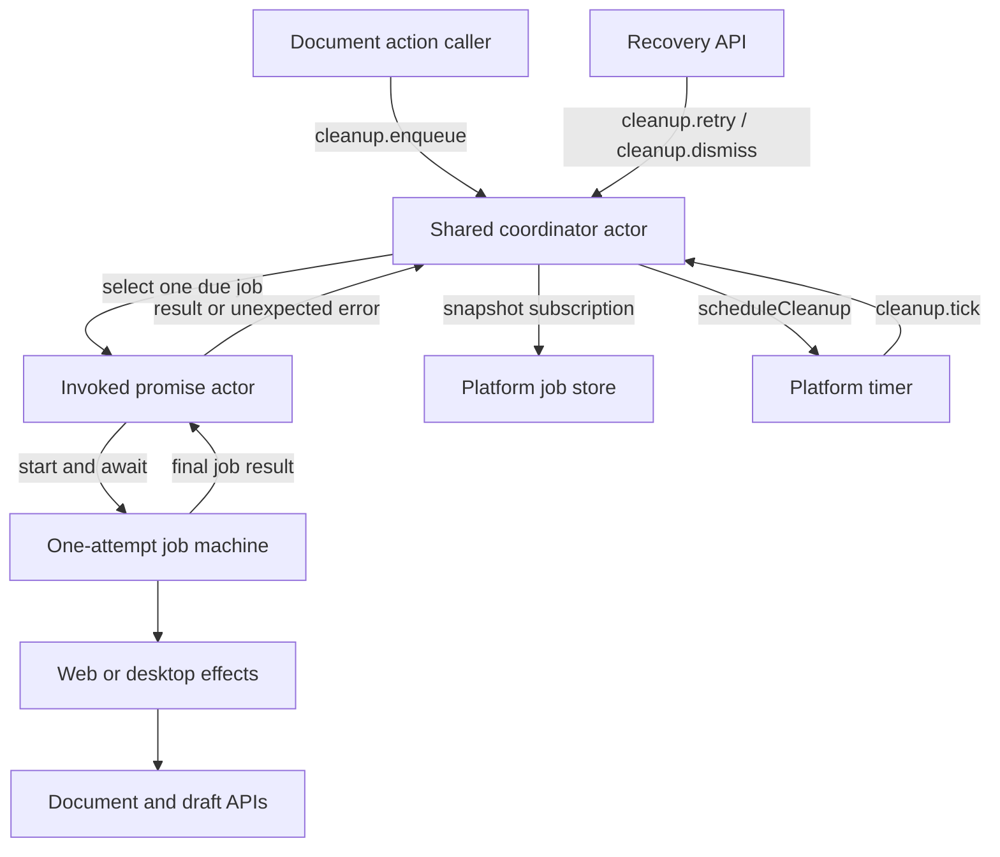
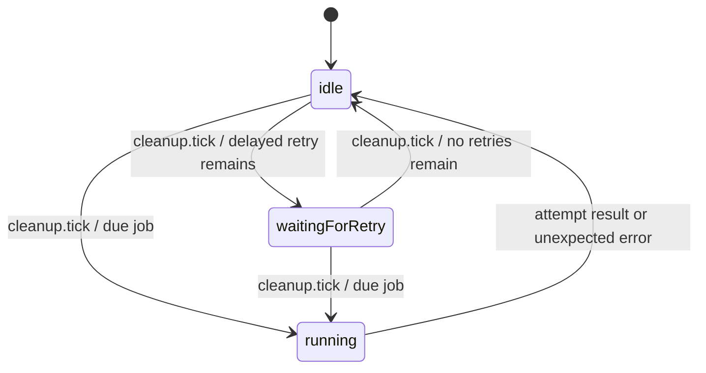
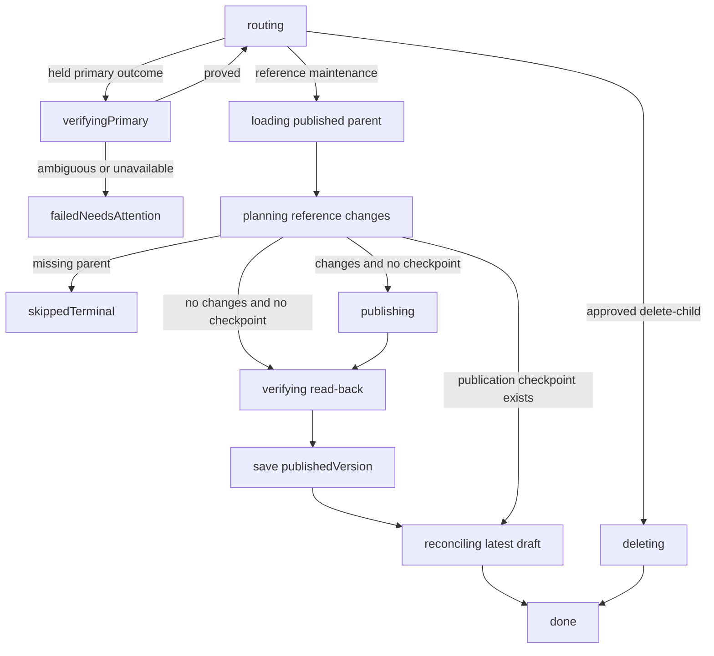
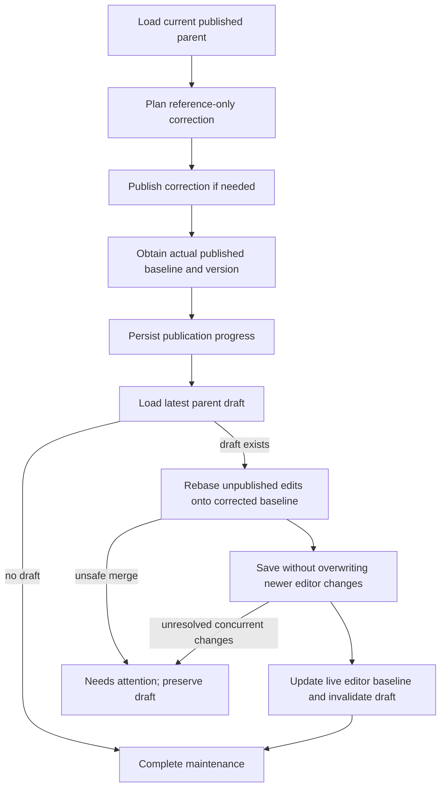

# Document reference actor model

For the problem, rationale, delivery scope, and constraints, start with the
[project brief](projects/document-reference-reconciliation.md). This technical companion explains the actor system
responsible for maintaining references between documents on web and desktop. It covers the implemented workflow,
recovery contracts, and remaining verification limitations. For the phase-by-phase checklist, see
[Document reference reconciliation](unreferenced-documents-implementation.md).

> **Status:** both apps now integrate parent publication followed by draft reconciliation, durable held intents,
> confirmed child deletion, and Needs attention. The browser worker uses exclusive Web Locks. This is not an
> exactly-once distributed transaction: storage can be unavailable, primary outcomes can be ambiguous, and unseen remote
> writes can race an unconditional backend tombstone. See the boundaries below and the implementation checklist for
> verification.

## 1. Mental model

A document operation and its parent maintenance are separate pieces of work. Publishing a child should succeed even when
repairing its parent's references fails. The failed follow-up remains recoverable rather than reversing the child
publication.

There are three responsibilities:

| Component             | Responsibility                                                                        | Does not own                         |
| --------------------- | ------------------------------------------------------------------------------------- | ------------------------------------ |
| Coordinator actor     | Own the queue, select work, count failures, schedule retries, handle manual recovery  | Editing document content             |
| One-attempt job actor | Load the target, calculate/apply the operation, report success, skip, or failure      | Retry policy or its own retry timer  |
| Platform adapter      | Supply storage, document/draft APIs, signing, timers, invalidation, and notifications | A separate copy of scheduling policy |

An **actor** is a running unit with its own lifecycle. A **machine** describes its states and transitions. A **job** is
serializable data describing work, not a running actor. Keeping jobs separate from actors lets an app restart with fresh
actors rather than attempting to resume an old network promise.

The implementation uses [XState v5](https://stately.ai/docs/actors). It deliberately uses one generic attempt machine
parameterized by `add`, `remove`, `rewrite`, or confirmed `delete-child`, not a separate machine for every operation.

The promise wrapper runs `runCleanupJobWithMachine`, awaits the attempt actor using `toPromise`, and stops that actor in
`finally`. The coordinator is long-lived; an attempt actor lives for one execution only.

## 2. Where the system lives

| Layer                         | Source and lifetime                                                                                                                                                               |
| ----------------------------- | --------------------------------------------------------------------------------------------------------------------------------------------------------------------------------- |
| Shared machines and job types | [document-card-cleanup-machine.ts](../frontend/packages/shared/src/models/document-card-cleanup-machine.ts)                                                                       |
| Shared content planners       | [document-card-cleanup.ts](../frontend/packages/shared/src/utils/document-card-cleanup.ts)                                                                                        |
| Desktop adapter               | [app-document-card-cleanup.ts](../frontend/apps/desktop/src/app-document-card-cleanup.ts): module singleton in the Electron main process, shared by renderer windows through tRPC |
| Desktop startup               | [app-api.ts](../frontend/apps/desktop/src/app-api.ts) calls `startDocumentCardCleanupCoordinator`                                                                                 |
| Web adapter                   | [web-document-card-cleanup.ts](../frontend/apps/web/app/document-edit/web-document-card-cleanup.ts): module singleton in the browser page, supplied with a UniversalClient        |
| Web startup                   | [document-maintenance.tsx](../frontend/apps/web/app/document-maintenance.tsx) starts recovery from the app root                                                                   |

Desktop uses `appStore` for queue persistence, desktop draft APIs, and document/signing APIs. Web uses `localStorage`
for the queue and the web draft database for drafts. Its non-browser fallback is an in-memory store, not durable
storage.

A web singleton is **per page/tab**, not per browser profile. The tabs share local storage, and an exclusive Web Lock
serializes worker ownership while draining the durable command inbox and queue. BroadcastChannel draft notifications
propagate changes to editors; they are not the queue lock.

Neither platform runs jobs while the application/page is closed. Recovery is local to the device/browser profile; there
is no server worker or cross-device queue synchronization.

## 3. Job data and operation meanings

Current jobs contain:

| Fields                                                                            | Meaning                                                                                 |
| --------------------------------------------------------------------------------- | --------------------------------------------------------------------------------------- |
| `id`                                                                              | Durable job identity; primary-operation intents include a unique lifecycle ID           |
| `operation`                                                                       | `add`, `remove`, `rewrite`, or `delete-child`; absent legacy values mean `remove`       |
| `source`, `target`                                                                | Complete `UnpackedHypermediaId` objects, captured at the original operation's locations |
| `container`                                                                       | Explicit reference container only when it differs from the inferred hierarchical parent |
| `signingAccountUid`, `capabilityId`                                               | Signing context                                                                         |
| `awaitingPrimary`, `primaryConfirmed`                                             | Expected primary outcome and whether execution is authorized                            |
| `publishedVersion`                                                                | Verified parent-publication checkpoint, separate from draft completion                  |
| `approvedSubtree`, `authorizingParentVersion`                                     | Confirmed destructive scope and the parent version authorizing it                       |
| `cardBlockId`, `cardParentId`, `cardLeftSibling`, `targetBlockId`, `childDraftId` | Card identity, placement, and selected-reference targeting                              |
| `state`, `attempts`, `maxRetries`, `nextRunAt`, `lastError`                       | Execution outcome and retry accounting                                                  |
| `createdAt`, `updatedAt`, `isDraft`, `parentDraftId`                              | Timing and draft-target information                                                     |

`getCleanupJobParent` derives the destination's parent for `add` and the source's parent otherwise, unless an explicit
container is necessary. The enqueue APIs still accept strings at their boundaries; hydration migrates old persisted
string aliases into structured identities and strips redundant fields. Stores use `schemaVersion: 2` under the existing
storage key. Primary proof and approved-scope records retain their explicit ID/version fields.

**A `remove` job removes cards; only an explicitly approved `delete-child` job can tombstone a child subtree.**

Pending adds are superseded by later confirmed removals, or retargeted by renames. Active work finishes before
subsequent work runs. Completed records do not prohibit a later independent lifecycle at the same path.

## 4. Coordinator lifecycle and ordering

`waitingForRetry` is exposed as `retryWaiting` in the public snapshot. The coordinator context holds `jobs`,
`activeJobId`, and the scheduler's `lastNow` timestamp.

| Event                    | Behavior                                                                |
| ------------------------ | ----------------------------------------------------------------------- |
| `cleanup.enqueue`        | Append a new, nonduplicate job and schedule a wake-up                   |
| `cleanup.tick`           | Refresh the clock and select due work when not already running          |
| `cleanup.retry`          | Reset an attention item's retry allowance and make it runnable          |
| `cleanup.dismiss`        | Archive an attention item as dismissed; it does not repair any document |
| `cleanup.clearDismissed` | Permanently remove dismissed history only                               |

Only **one job executes at a time per coordinator**. Runnable jobs retain queue order within the same parent. A delayed
retry for parent P prevents later queued work for P from overtaking it, but does not prevent work for parent Q from
running. An attention item is not runnable and does not indefinitely block later jobs for that parent.

Timers belong to the adapter. The coordinator calculates the delay; the adapter schedules a `cleanup.tick`. A tick
without an explicit timestamp uses the current clock, not an old saved timestamp. Ticks during execution are ignored;
completion schedules the next opportunity to run.

## 5. One-attempt lifecycle

Each asynchronous stage reports failures to the coordinator. `verifying` reloads the parent, requires a real version,
and checks whether reference maintenance still has outstanding changes. It is no longer invalidation-only.

An add involving an inline child draft first captures the temporary card's identity/usable placement. Parent publication
uses the published baseline, not unpublished draft content. After successful verification, the checkpoint is persisted
before draft reconciliation. A retry reloads the parent and finishes reconciliation without repeating the publication.

A held intent is saved before the primary action and released after success. On restart, recovery requires evidence: for
example an exact signed publication version, or the captured redirect target and document identity. Existence alone is
not proof of first publication. If the platform cannot prove the outcome, work becomes Needs attention instead of
speculatively changing a parent or deleting children.

## 6. Retries, persistence, and recovery

The attempt reports failure once. Only the coordinator increments `attempts` and chooses what happens next. In the
current code, `attempts` counts recorded failures, not every execution start.

| Failed execution | Result with default `maxRetries = 3`   |
| ---------------- | -------------------------------------- |
| Initial attempt  | Retry after 1 second; `attempts = 1`   |
| First retry      | Retry after 5 seconds; `attempts = 2`  |
| Second retry     | Retry after 15 seconds; `attempts = 3` |
| Third retry      | `failedNeedsAttention`; `attempts = 4` |

The delays are eligibility deadlines, not a guarantee of exact execution time. An active job or closed app can delay
execution further. There is currently no richer transient/permanent error classifier; reported failures use this budget.

Adapters persist serializable public queue snapshots under `DocumentCardCleanupState-v001` on desktop and
`WebDocumentCardCleanupState-v001` on web. The old machine-snapshot keys are read only as a migration fallback when no
new-format job store exists. New writes do not persist in-flight promise actors.

On restart:

1. Load durable jobs, falling back to legacy snapshot `context.jobs` if needed.
2. Normalize interrupted `loadingParent`, `updating`, `publishing`, `verifying`, and `failed` jobs to `idle`.
3. Preserve retry counts, deadlines, terminal outcomes, and attention items.
4. Start a fresh coordinator and let it reload current document state for runnable jobs.

An interruption alone does not consume a retry. However, a publication may have succeeded just before a crash without
its outcome being saved. Work must therefore tolerate re-execution; this is **not an exactly-once execution system**.
Reference planners reduce duplicate effects by checking current content. Publication checkpoints and held primary
intents close the ordinary interrupted-work gaps. Storage failures gate subsequent worker mutations; they do not provide
a guarantee of durability when the storage device/browser itself refuses writes. The primary user action can still
succeed, with a warning that parent maintenance needs manual review.

Available recovery APIs:

- Desktop: `documentCardCleanupApi.getSnapshot`, `.retry({jobId})`, and `.dismiss({jobId})` through tRPC.
- Web: `getWebDocumentCardCleanupSnapshot()`, `retryWebDocumentCardCleanup(jobId)`, and
  `dismissWebDocumentCardCleanup(jobId)`.

Dismiss moves failed actions to persisted `dismissed` history, retaining timestamps, attempts, errors and publication
checkpoints. Dismissed jobs never run automatically or contribute to pending/attention counts. Startup, ticks and
dismissal prune records older than 90 days and retain at most the latest 500 dismissed actions. Clear history removes
only these records. A new generated-ID action at the same path archives the older record under a history ID; an explicit
primary-intent duplicate never revives dismissed work.

Reference actions can be restored via Review and retry, which clears stale checkpoints and performs fresh validation.
Deletion actions always require Review deletion and explicit consent, including when restored from history. Restoring an
action moves it back to active work; this is a recovery list, not an immutable audit log. Both app roots host one shared
maintenance dialog. Its Needs attention entry sits beside Agents in the desktop sidebar and web navigation; a compact
banner at the top of Notifications opens that same dialog. The Notifications warning is hidden when there is no active
work or queue-loading error. History alone leaves a neutral Document maintenance navigation entry without an attention
badge. Settings always provides access, even with empty active and dismissed lists (desktop General settings; web
account settings area and account menu). It shows affected documents, errors, pending work, and completed publication
progress. Changed deletion scopes require Review deletion and a new explicit confirmation; they do not get a generic
retry shortcut. The scope is fetched again when consent is submitted and revalidated during execution. Review refuses
moved or replaced roots rather than following them.

The Dismissed view offers explicit Copy diagnostic report and Clear history actions. Exported reports include document
IDs/paths, timestamps, failure counts, errors and completed-step descriptions, not signing capabilities. Nothing is
automatically uploaded; users must choose whether and with whom to share the report. History remains device-local.

## 7. Reference rules the jobs support

These rules are shared by the integrated web and desktop action entry points.

| Document action | Parent maintenance                                                                                           |
| --------------- | ------------------------------------------------------------------------------------------------------------ |
| First publish   | Add a card unless home/private child, collection parent, self-query parent, or any existing direct reference |
| Ordinary update | No automatic reference insertion                                                                             |
| Rename          | Rewrite existing matching reference destinations; queries update through their results                       |
| Move            | Remove cards from the old parent; conditionally add at the new parent using first-publish suppression rules  |
| Explicit delete | Remove cards from the parent only; leave normal/inline links for the editor to remove                        |

Reference detection includes cards, normal links, inline references, and nested content. Rewrite changes destinations,
not authored link text. Programmatically changed blocks must not retain stale revisions; unchanged blocks retain theirs.
A self-query covers all direct children even when filtered or paginated. It suppresses both card insertion and child
deletion proposals. Removing the last published self-query causes the inspector to review all direct children that lose
their final reference; deletion still requires explicit confirmation.

## 8. Published parent first, then draft reconciliation

Do not literally erase the draft temporarily. Publish from the published baseline, then rebase the latest draft. Track
publication and draft reconciliation independently so a retry resumes the unfinished part. Use the actual returned or
reloaded version, never an optimistic synthetic baseline. Coordinate writes with autosave/live editing so a late
maintenance result cannot overwrite newer user edits.

Example: parent P contains a card to child A. The user deletes that card in P's draft, then renames A to B.

- Published P must be corrected to contain the card to B.
- The rebased draft must still omit that card: the user's deletion applies to the renamed card's identity.
- Discarding the draft restores published P with the card to B.
- Publishing the draft may propose deleting B, but only through the confirmed-deletion workflow below.

Draft reconciliation uses atomic compare-and-swap against the complete saved draft snapshot. Desktop serializes its
in-process draft reads/writes/deletes; web compares and writes in one IndexedDB transaction. `maintenancePreviousDeps`
records invalidated baselines, and `maintenanceRevision` protects corrections even when publication heads stay
unchanged, so a delayed autosave cannot undo maintenance. Rejected stale saves retain recovery data. Live editors merge
against the previous saved draft snapshot, preserve unsaved text and metadata, update their published baseline, and
schedule saving. Unsafe merges preserve the live edits and report the job to Needs attention.

## 9. Deletion after removing the last reference

Record user reference-removal intent separately from automatic maintenance. Before parent publication, compare that
intent with final content and propose deletion only when all conditions hold:

1. The reference destination is a **direct child** of this parent: same account and exactly one additional path segment.
2. The user removed a direct reference during editing or removed the published self-query; absence alone is
   insufficient.
3. No card, normal link, inline reference, or self-query covering that child remains in the final parent content.
4. The user explicitly confirms deletion of the child and its descendant subtree.

Removing a reference to a sibling, ancestor, deeper descendant, or another account does not authorize deletion. Removing
the last published self-query (or retargeting it away from this parent) triggers review of its full direct-child scope,
not just the currently displayed results. Changing a display limit, sorting, or replacing it with another self-query
never triggers deletion. Undo, restoration, discard, and system-generated changes must not leave behind destructive
authorization. Query-removal intent is derived from the persisted published baseline and final draft content; simply
adding and removing a query within the same draft does not authorize bulk deletion.

After confirmation, publish the parent and materialize the approved deletions through durable work with per-target
progress. Persist the confirmed scope. A retry must not follow a moved target or silently include newly created
descendants; changed scope requires renewed confirmation. Revalidate reference restoration before delayed deletion.

The editor persists authored removal intent with its draft, including raw web URLs for asynchronous resolution at
publication preflight. Programmatic maintenance does not create removal intent; renames retarget existing intent. The
`getDirectChildrenLosingReferences` helper remains detection-only and is not authorization by itself.

Custom-domain aliases are resolved before decisions. Unresolved surviving links prevent automatic deletion of known
candidates. An unresolvable removed URL cannot identify a child and is skipped rather than authorizing an unknown
target. This can leave an unreferenced document requiring manual review.

Execution verifies the historical authorizing parent version and its identity, as well as the latest parent references,
subtree membership, and approved document versions. It deletes deepest-first and treats tombstones as already completed
steps. Checks repeat before each deletion, but are not an atomic transaction with remote writes.

## 10. Boundaries and remaining work

Keep the architecture simple: shared policy, platform effects, serial execution, and explicit outcomes. There is no need
for a distributed actor framework or one actor per document that runs forever.

Important boundaries:

- Per-device/browser recovery is not cross-device queue synchronization, and apps do not execute jobs while closed.
- Unknown primary outcomes require attention instead of guessing that the user action succeeded.
- Web storage loss, cleared site data, and unavailable Web Locks prevent automatic recovery; the UI must not claim
  repair.
- Desktop serialization does not lock external CLI filesystem edits; the existing separate index/body files are not a
  crash-atomic filesystem transaction.
- Backend tombstones are timestamp-based, unconditional visibility changes, not physical deletion of content blobs.
  There is no expected-version/subtree/parent-reference precondition on the tombstone write. Unseen concurrent remote
  edits can race validation. A stronger guarantee requires backend/protocol work; do not claim exactly-once or globally
  serializable deletion.
- Live web/desktop publication and restart smoke tests are still necessary before production sign-off. Unit and
  component tests cannot substitute for authenticated end-to-end verification.

## 11. Code and regression-test map

- [Coordinator tests](../frontend/packages/shared/src/models/__tests__/document-card-cleanup-machine.test.ts):
  scheduling, retry budgets, interruption recovery, and manual recovery.
- [Reference tests](../frontend/packages/shared/src/utils/document-card-cleanup.test.ts): reference matching, card-only
  removal, rewrites, and direct-child candidates.
- [Rebase tests](../frontend/packages/shared/src/utils/document-changes-rebase.test.ts) and
  [document-machine tests](../frontend/packages/shared/src/models/__tests__/document-machine-rebase.test.ts): merge
  semantics and published-baseline bookkeeping.
- [Desktop adapter tests](../frontend/apps/desktop/src/__tests__/app-document-card-cleanup.test.ts) and
  [web adapter tests](../frontend/apps/web/app/document-edit/web-document-card-cleanup.test.ts): platform integration
  and recovery behavior.

These regressions cover implemented behavior and failure paths; live-app verification remains a separate release gate.
