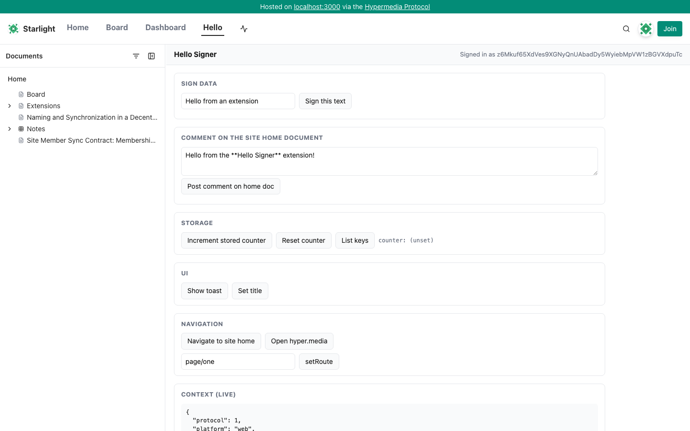
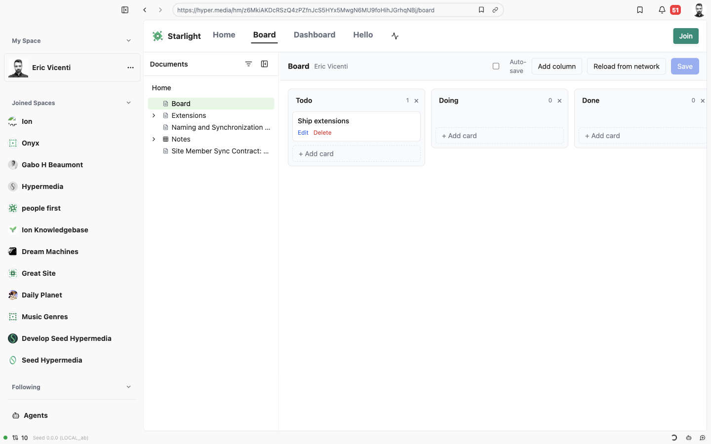

# Extensions — Project report (branch `feat/extensions`)

Written 2026-08-31 at the end of the first build. This is the "where things stand" page: what exists, how it was
verified, how to try it, what is deliberately not done, and everything an implementer picking the branch up needs that
is not derivable from the code. The normative spec is [design.md](./design.md); the decision history is
[decisions.md](./decisions.md); the verification log is [testing.md](./testing.md).

## Scope delivered

Full-page ("Custom Page") extensions for **web and desktop**, distributed as hypermedia documents, with a bridge that
lets an extension read hypermedia data and **sign as the viewer without ever holding a key**. Every layer below the page
kind is kind-agnostic so blocks / attribute editors / themes can reuse it ([roadmap.md](./roadmap.md)).

| Layer                         | Location                                                                                                                                          |
| ----------------------------- | ------------------------------------------------------------------------------------------------------------------------------------------------- |
| Schemas, resolution, protocol | `frontend/packages/client/src/extensions.ts`                                                                                                      |
| Host (shared by both apps)    | `frontend/packages/ui/src/extensions/` — `ExtensionPage`, `ExtensionFrame`, bridge server, handlers, sign dialog, dev overrides, nav items        |
| Web integration               | `frontend/apps/web/app/routes/$.tsx`, `extension-route.ts`, `web-extension-page.tsx`, `routes/hm.api.file.$.tsx`                                  |
| Desktop integration           | `frontend/apps/desktop/src/components/{desktop-extension-page,site-settings-extensions,extension-dev-overrides}.tsx`, `utils/extension-*`         |
| Extension SDK (iframe side)   | `frontend/packages/extension-sdk` (`@seed-hypermedia/extension-sdk`)                                                                              |
| CLI                           | `seed-cli extension publish · inspect · install · uninstall · list · update` (`frontend/apps/cli/src/commands/extension.ts`)                      |
| Examples                      | `extensions/examples/{hello-signer,site-dashboard,kanban}`                                                                                        |
| Tests                         | unit suites in client / ui / sdk / web / desktop / cli; CLI fixture suite; Playwright browser test `tests/extensions.browser.integration.test.ts` |
| Docs                          | `docs/extensions/` (this folder), mirrored on the network under the Starlight space                                                               |

## Where to try it

The three examples are published under the **Starlight** account (`z6MkiAKDcRSzQ4zPZfnJcS5HYx5MwgN6MU9foHihJGrhqNBj`) at
`extensions/examples/*` and installed on that site, pinned:

| Mount        | Extension      | What to expect                                                                                              |
| ------------ | -------------- | ----------------------------------------------------------------------------------------------------------- |
| `/hello`     | Hello Signer   | Live context panel; buttons for `sign.data`, `sign.comment`, storage, toast, navigate, `setRoute`.          |
| `/dashboard` | Site Dashboard | Document table with comment counts, stat tiles, search, recent activity. Read-only.                         |
| `/board`     | Kanban         | Board stored in `metadata.kanban` of `hm://<site>/board`; Save opens the signing dialog. Owner-only writes. |

- Desktop (mainnet dev build from this branch): open `hm://z6MkiAKDcRSzQ4zPZfnJcS5HYx5MwgN6MU9foHihJGrhqNBj/board`; the
  site header shows **Board · Dashboard · Hello**.
- Web (local dev server from this branch, any registered site): gateway form
  `http://localhost:3000/hm/z6MkiAKDcRSzQ4zPZfnJcS5HYx5MwgN6MU9foHihJGrhqNBj/hello`. On a deployed gateway the same path
  works under `https://hyper.media/hm/<uid>/hello` once this branch ships.
- Hot reload: `pnpm --filter @seed-extensions/kanban dev` then append `?extdev=http://localhost:5183` (loopback only) or
  add the override in desktop Settings → Advanced → Extension dev overrides.
- Space settings → **Extensions** on desktop: paste an `hm://` extension URL, Fetch, review the manifest, pick the
  mount, Install (pinned by default).

## How it was verified

- Unit: client 49, ui 112, extension-sdk 20, web 252, desktop 11 (extension helpers), cli 168 + 16; CLI fixture suite 11
  against a real daemon; Playwright browser integration test 4/4 (publishes + installs hello-signer on a fixture site,
  checks sandbox flags, handshake, storage, `not_signed_in`, gateway form, `?extdev=` on/off).
- Manual, headless Chromium against the local web dev server and mainnet Starlight: handshake, storage, toast,
  `sign.data` and `sign.comment` through the native dialog (comment verified in the daemon), kanban `sign.document` as a
  non-member (refused with the daemon's capability error) and as the owner (document created, card persisted across
  reload), dashboard data, iframe survival across sub-path navigation.
- Manual, desktop dev app driven over CDP: same flows with `platform: desktop`, signing through the daemon, Space
  settings → Extensions install form (fetch + manifest preview).
- Review: a 26-agent workflow (six lenses, each finding adversarially verified) produced 18 confirmed findings and 8 doc
  inaccuracies; all were fixed and re-verified. The two high-severity ones — `?extdev=` accepting arbitrary hosts, and
  `navigate('/\\evil.com')` escaping the origin — are recorded in [decisions.md](./decisions.md) and
  [security.md](./security.md).

## Environment notes for the next person

- The local web dev server is registered to a different account than Starlight, so the gateway form
  (`/hm/<uid>/<mount>`) is the primary local test path; site-native `/<mount>` works on the registered site.
- The local daemon must have discovered the extension documents and the home document version that carries the install
  records. If a page shows "Extension unavailable … not available on this node yet", POST `/hm/api/discover` for the
  site home and the extension documents (or open them once in the desktop app).
- Web dev under heavy file churn can wedge Vite's optimizer ("Invalid hook call" on hydration, or a cached config 500):
  restart `pnpm web` and `rm -rf frontend/apps/web/node_modules/.vite`.
- Driving the desktop dev app over CDP: kill every `node_modules/electron/dist/Electron.app` process first — a leftover
  instance holds the single-instance lock and a new one hangs after `will-finish-launching` with no window. Launch
  `pnpm dev:debug` (not under a pty). Navigate by clicking the omnibar URL span, then typing into the visible input.
- A throwaway CLI key named `exttest` was created on mainnet for signing tests; its test comments were deleted.
- Pre-existing failures unrelated to this branch: client `client.test.ts` (Search mock), `vault-local.test.ts` (reads
  the machine's real vault), ui `comments.test.tsx` (routes mock), desktop `agents-live-titling` (needs the agents
  server).

## Deliberately not done

- Template (native-component) UI modality — the bridge is designed for it; no host implements it.
- Extension kinds other than `page` (`block`, `attribute`, `theme` are reserved in the schema only).
- CLI publishing/installing under a shared space account (the CLI signs as the key's own account; the desktop UI handles
  shared spaces).
- Network egress control for the iframe, resource limits, per-viewer settings, extension directory/discovery UI.
- `setRoute` query parameters on desktop (the desktop document route has no query field).
- Nav entries render in the site header on both platforms, not in the desktop sidebar.

## Open questions

See the end of [roadmap.md](./roadmap.md): per-document install capabilities, a manifest `csp` field for frame egress,
and a "verified publisher" signal in the install UI.
