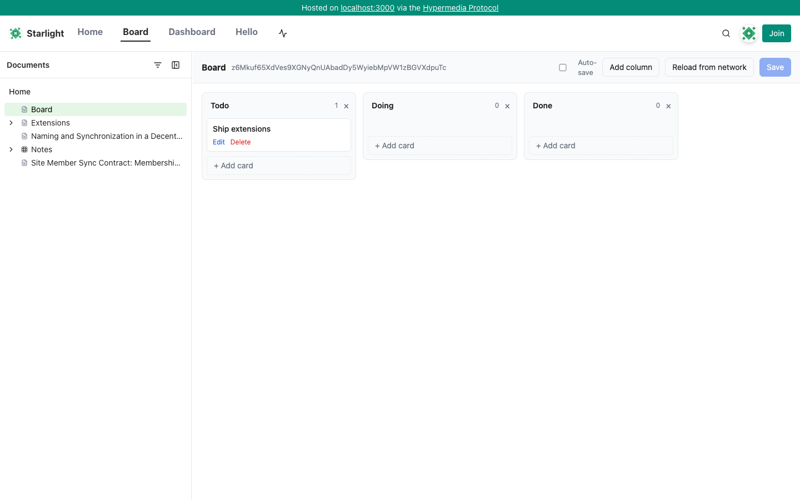
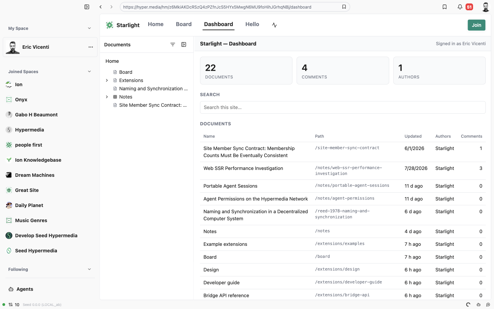
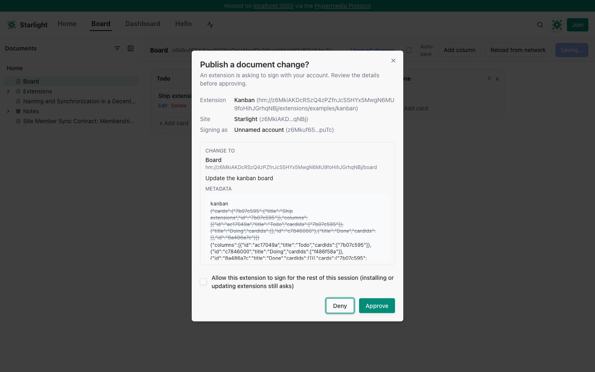
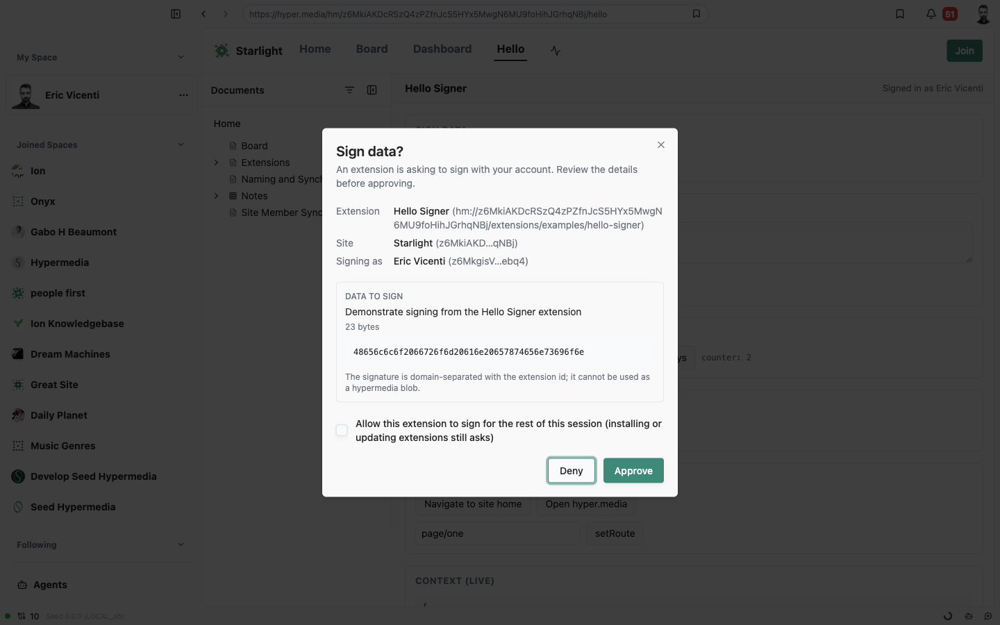
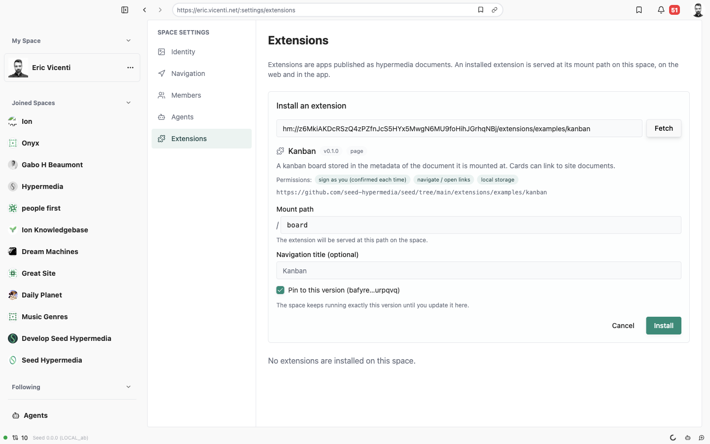

# Extensions — what kind, and what for

This page answers two questions before any mechanics: **which type of extension does this system cover**, and **what
would someone build with it**. For how it works see [design.md](./design.md); for the state of the branch see
[project-report.md](./project-report.md).

## Which extensibility type this is

The team's [Types of Extensibility](https://seedteamtalks.hyper.media/tech/types-of-extensibility)
(`hm://z6MkuBbsB1HbSNXLvJCRCrPhimY6g7tzhr4qvcYKPuSZzhno/tech/types-of-extensibility` in the app) lists eleven ways to
extend Seed. This branch implements exactly one of them, **Custom Page** — "a custom 'app' page, where everything under
the site header is custom UI" — and builds the shared machinery (packaging, install, permissions, sandbox, signing
bridge, CLI, dev loop) that the other UI kinds will reuse later.

| Type from the roadmap                                                  | In this PR                                                                                                    |
| ---------------------------------------------------------------------- | ------------------------------------------------------------------------------------------------------------- |
| **Custom Page** (full app under the site header)                       | **Yes.** `kind: "page"`, mounted at a path on a site, on web and desktop.                                     |
| Custom Document/Resource UI (a page that saves to a specific document) | Partly — a page extension can use the document at its mount path as its data store (the kanban example does). |
| Block UI / Custom Block                                                | No. Reserved as `kind: "block"` in the schema; see [roadmap.md](./roadmap.md).                                |
| Custom Attribute UI                                                    | No. Reserved as `kind: "attribute"`.                                                                          |
| Theming, look and feel                                                 | No. Reserved as `kind: "theme"`.                                                                              |
| Custom Indexer                                                         | No (daemon-side, separate track).                                                                             |
| APIs, SDK, Services, Tools                                             | Already exist; extensions consume the APIs through the bridge and are published with the SDK/CLI.             |
| UI modality                                                            | **iframe** ("developer wants their own CSS+HTML"). The template/native modality is not built yet.             |

So: an extension here is **a web app that runs inside a Seed site**, at a URL of the site (`site.com/board`,
`hm://<site>/board`), rendered under the site's own header and navigation, on the web and in the desktop app. It is
written in plain HTML/JS/CSS with any framework, and it is distributed as a hypermedia document like any other content.

## What an extension can do

| Capability                             | How                                                                                                                                                   |
| -------------------------------------- | ----------------------------------------------------------------------------------------------------------------------------------------------------- |
| Read the site's content                | `seed.query(...)`: documents, metadata, comments, activity, citations, search — everything the viewer can already see.                                |
| Know who is looking                    | `seed.context.user` (account id + name), or `null` when signed out.                                                                                   |
| Write, as the viewer                   | `seed.sign.comment(...)`, `seed.sign.document(...)` — the host builds the blob and signs it with the viewer's key after a native confirmation dialog. |
| Sign arbitrary app data, as the viewer | `seed.sign.data(bytes, purpose)` — domain-separated so it can never be mistaken for a Seed blob (votes, receipts, attestations).                      |
| Remember things per viewer             | `seed.storage` (per extension, per site, in the viewer's browser).                                                                                    |
| Move around                            | `seed.navigate(hm://…)`, `seed.setRoute(subPath)` for its own routing beneath the mount, `openExternal`.                                              |
| Look native                            | Theme (light/dark) and a small CSS variable set from the host; the site header and nav stay around it.                                                |

What it **cannot** do: see keys (it only ever gets signatures back), sign silently (every signature is confirmed by the
viewer), touch the host page or its cookies/storage (opaque-origin sandbox), or change what code a site runs (installs
are pinned by document version and written by the site owner). Details in [security.md](./security.md).

## Use cases

The three shipped examples are meant as templates for these:

**1. Dashboards and overviews of a site** (`site-dashboard`). A publication wants a "newsroom" view: every document, who
edited it last, how many comments, what changed this week, a search box. Today that needs a fork of the web app; with an
extension it is one HTML file installed at `/dashboard`. Variants: an editorial calendar, a "stale documents" report, a
contributor leaderboard, a citations map.

**2. Apps whose state is a document** (`kanban`). A team wants a kanban board over their documents: columns and cards
live in `metadata.kanban` of the document at `/board`; moving a card produces a signed document change by the person who
moved it, so history, authorship and sync come for free. Variants: a roadmap/timeline, a reading list with statuses, a
glossary editor, a decision log with structured fields, an issue tracker where each card links to a document.

**3. Interactive tools that sign as the viewer** (`hello-signer` shows the primitives). A site wants readers to _do_
something, not just read: RSVP to an event, vote on a proposal, sign a petition or a statement of support, submit a form
that becomes a comment or a document, attest "I reviewed this version". Each action is a signature by the reader's own
account, confirmed in a dialog they can read, and stored as hypermedia data anyone can verify.

**4. Custom ways to browse a site.** A gallery of image documents; a map of documents with coordinates in their
metadata; a table view of a folder with sortable attributes; a "start here" onboarding page that walks a newcomer
through a curated path. These are read-only and need nothing but `query` and `navigate`.

**5. Site-specific integrations, read from the viewer's side.** A course site that shows each student their own progress
(comments they wrote, documents they completed); a community that shows "members who cited this"; a research group's
citation graph. The extension reads through the viewer's client, so it sees exactly what they may see.

Common to all of them: the site owner installs the extension with one action, readers get it in the site's own
navigation on web and desktop, and the extension author never runs a server.

## When not to use a page extension

- You want a new kind of **content inside documents** (a chart block, an embedded form) → that is a custom block; not in
  this PR, but the same manifest/install/bridge will host it.
- You want to change **how the site looks** → theming metadata, not code.
- You need **background work, private state, or to act on behalf of a site** (notifications, agents, indexing) → a
  service or an agent tool; extensions run only while a viewer has the page open and only sign as that viewer.
- You want to **modify the editor** → not an extension surface.

## Why this type first

Highest expressed demand (dashboards, boards, forms), and it exercises the whole lifecycle — packaging, discovery,
install, permissions, sandboxing, signing UX, hot-reload — without touching the editor. Everything below the page kind
is kind-agnostic, so custom blocks are an increment rather than a second system. Rationale and alternatives are in
[decisions.md](./decisions.md); the sequence for the other kinds is in [roadmap.md](./roadmap.md).
