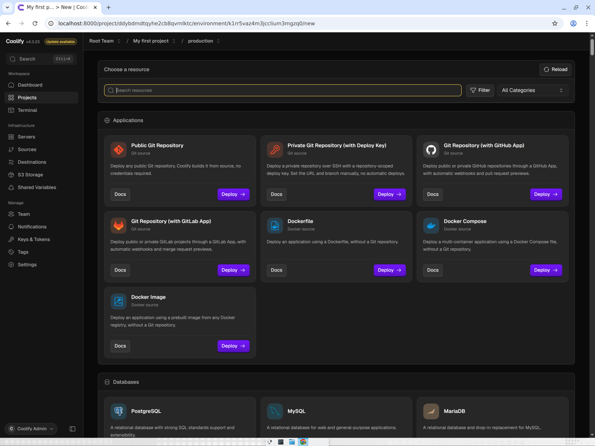
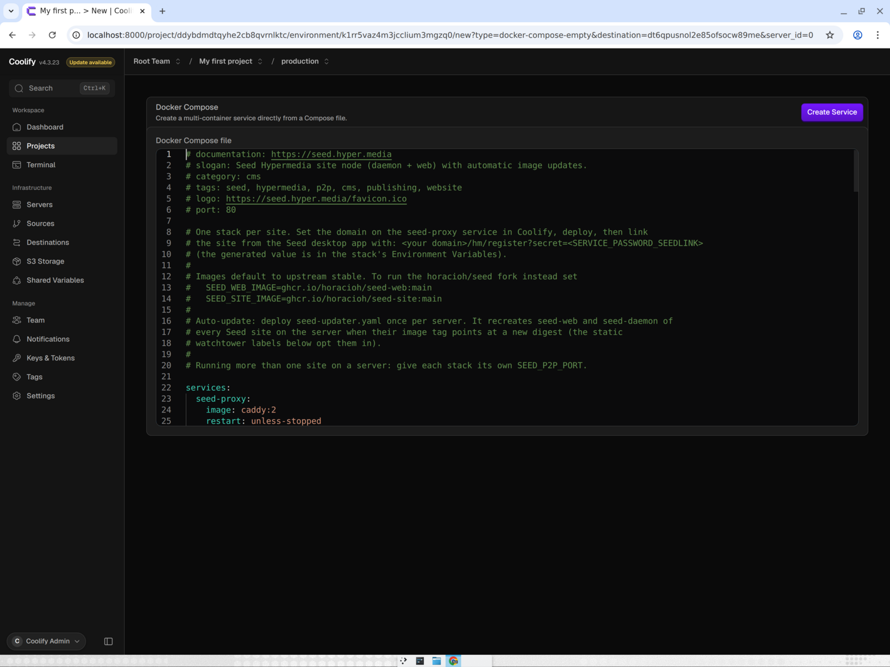
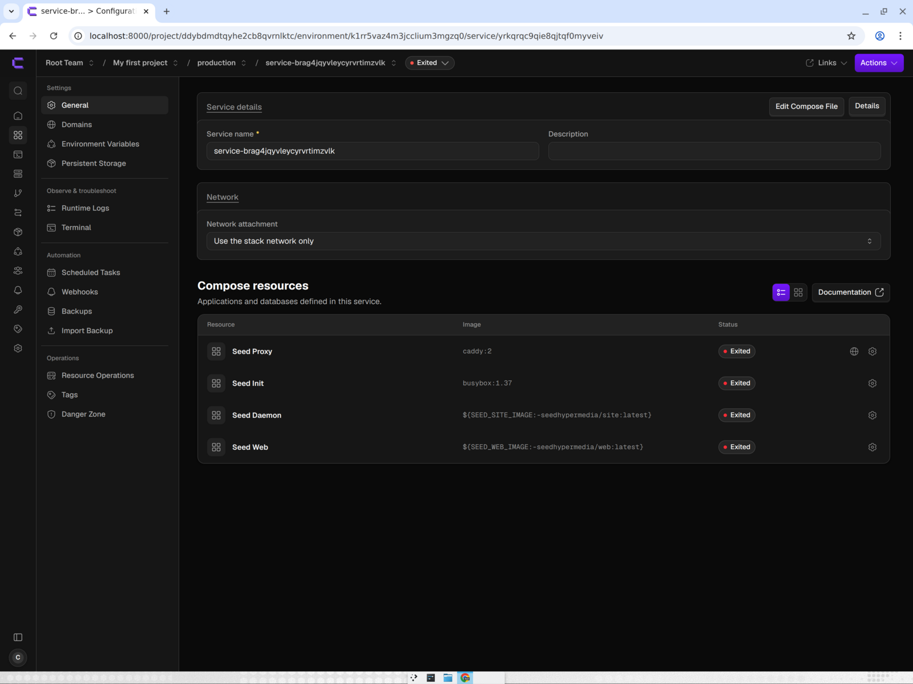
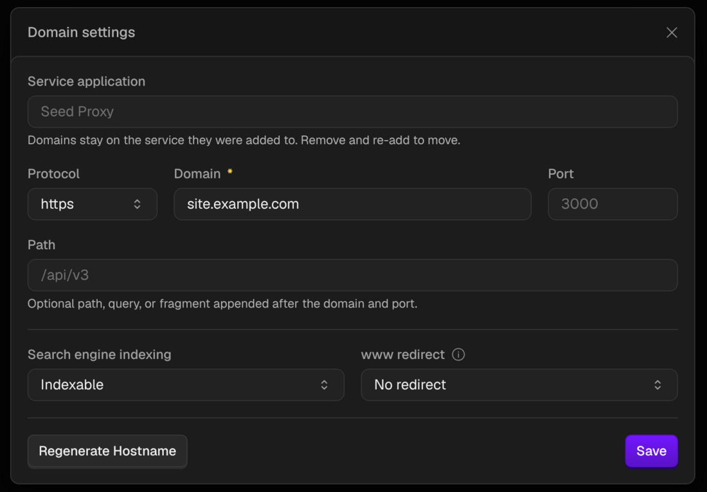
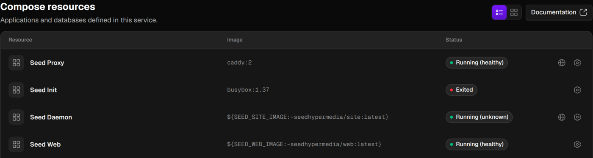
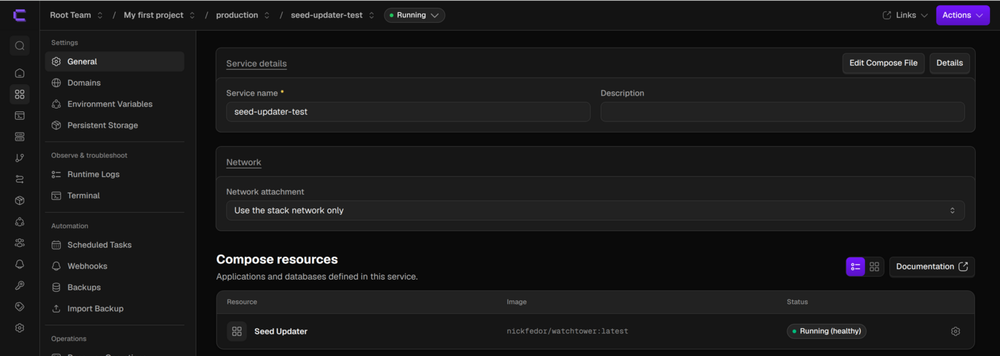
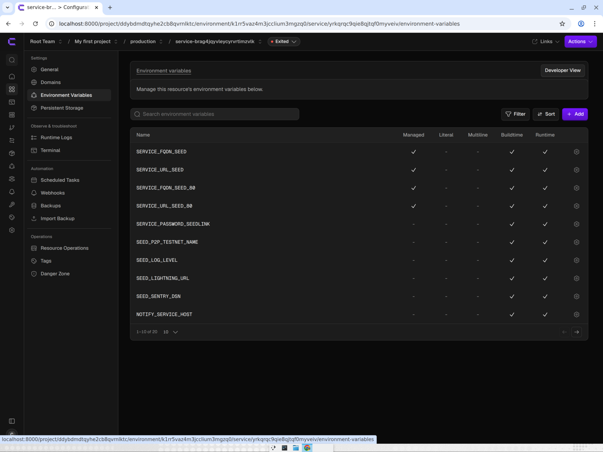
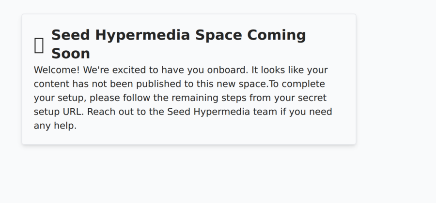

# Deploy a Seed site on Coolify

The site stack runs a daemon, web app, and internal Caddy proxy; Coolify's proxy handles HTTPS. A separate Watchtower
stack can update all Seed sites on the same server.

## Before you start

- A Coolify v4 server and a domain whose DNS points to that server.
- A public P2P port, `56000` by default, open for both TCP and UDP. Use a unique port for each Seed site on the server.
- The Seed desktop app, which you will use to register the site.

## Step 1: Create the Seed site resource

1. In your Coolify project, add a new resource and choose **Docker Compose** (deploy a multi-container application from
   a Compose file, without a Git repository).

   

2. Paste the contents of `ops/coolify/seed-site.yaml` into the Compose editor, then click **Create Service**.

   

   Coolify creates the stack with four resources: Seed Proxy, Seed Init, Seed Daemon and Seed Web.

   

3. Open **Domains** in the stack's menu, open the settings of the Seed Proxy domain, set **Protocol** to `https` and
   **Domain** to your hostname (for example `site.example.com`), then **Save**. Use one domain with no path.

   

4. To use the fork's images instead of the upstream defaults, add these two variables under **Environment Variables**:

   ```text
   SEED_WEB_IMAGE=ghcr.io/horacioh/seed-web:main
   SEED_SITE_IMAGE=ghcr.io/horacioh/seed-site:main
   ```

   The default P2P port is `56000`; if you change it, use a unique port and open it for TCP and UDP.

## Step 2: Deploy the site and updater

1. Deploy the site stack. Wait for the proxy and web service to become healthy and the daemon to be running. Seed Init
   runs once to write the initial config and then shows **Exited**; that is expected.

   

2. Create another **Docker Compose** resource and paste `ops/coolify/seed-updater.yaml`. Deploy this updater once per
   server; it needs no domain. It checks for image updates every `600` seconds by default.

   

## Register the site from Seed desktop

Copy `SERVICE_PASSWORD_SEEDLINK` from the site's **Environment Variables**.



Use this registration link in the Seed desktop app:

```text
https://<domain>/hm/register?secret=<SERVICE_PASSWORD_SEEDLINK>
```

The registration secret is written to the web data volume on first start and is consumed when the site is registered.
Until registration is complete, the site shows a “coming soon” page.



## Check that it works

Run:

```sh
curl -fsS "https://<domain>/hm/api/config"
```

The response should be JSON.

## Updates

`seed-updater.yaml` is a separate stack: without it, the site does not auto-update. The updater checks the `seed-web`
and `seed-daemon` containers of every Seed site on the server every `SEED_UPDATE_INTERVAL` seconds (`600` by default).
The default `latest` tags follow upstream stable releases; the fork's `ghcr.io/horacioh/seed-*:main` tags follow pushes
to `custom-images`. Pin an exact version tag to stop following a moving tag.

## Backups

Back up both named volumes: `seed-daemon-data` contains the database, blobs, and node keys; `seed-web-data` contains
`config.json`.

## Troubleshooting

- Use Coolify's port-less `SERVICE_URL_SEED` and `SERVICE_FQDN_SEED` for the app. The `_80` variants include `:80` and
  are for routing the domain to `seed-proxy`, not for the app URL or daemon announce address.
- If images are not updating, check that the separate `seed-updater.yaml` stack is deployed on the server.
- Each site on a server needs a different P2P port, open for both TCP and UDP.
